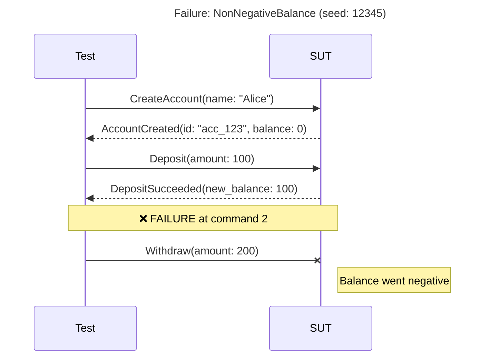

# PropertyDamage

A stateful property-based testing (SPBT) framework for Elixir.

PropertyDamage generates random sequences of operations against your system and verifies that invariants hold throughout. When a failure is found, it automatically shrinks the sequence to the minimal reproduction case.

## Features

- **Stateful Testing**: Generate sequences of commands, not just individual inputs
- **Automatic Shrinking**: Failed sequences are minimized to the smallest reproduction
- **Symbolic References**: Commands can reference results from earlier commands
- **Parallel Execution**: Branching sequences for race condition detection
- **Linearization Checking**: Verify parallel results are sequentially explainable
- **Idempotency Testing**: Built-in stutter testing for retry safety
- **Rich Failure Reports**: Comprehensive diagnostics when tests fail
- **Failure Persistence**: Save failures for later analysis and regression testing
- **Step-by-Step Replay**: Debug failures by executing commands one at a time
- **Seed Library**: Track and share interesting seeds across your team
- **Coverage Metrics**: Know how thoroughly your model is being exercised
- **Flakiness Detection**: Identify non-deterministic behavior in your SUT
- **Load Testing**: Generate realistic load using SPBT traffic patterns
- **Visual Diagrams**: Sequence diagrams in Mermaid, PlantUML, WebSequence formats
- **Diff Debugging**: Compare passing vs failing runs to find divergence
- **Failure Export Hub**: Convert failures to portable artifacts (scripts, tests, notebooks)
- **Mutation Testing**: Verify your tests catch bugs by injecting faults
- **Invariant Suggestions**: Get AI-powered suggestions for missing checks
- **Failure Intelligence**: Pattern detection, similarity analysis, and fix verification
- **OpenAPI Scaffolding**: Generate command modules from API specifications
- **Telemetry Dashboard**: Real-time monitoring of test runs with LiveView integration
- **Livebook Integration**: Interactive exploration with rich visualizations and charts
- **Chaos Engineering**: Built-in nemesis operations for network, resource, time, and process faults

## Installation

Add `property_damage` to your list of dependencies in `mix.exs`:

```elixir
def deps do
  [
    {:property_damage, "~> 0.1.0"}
  ]
end
```

## Quick Start

### 1. Define Commands

Commands represent operations that can be executed against your system:

```elixir
defmodule MyApp.Commands.CreateUser do
  use PropertyDamage.Command

  defstruct [:name, :email]

  @impl true
  def new!(state, generators) do
    %__MODULE__{
      name: Faker.Person.name(),
      email: Faker.Internet.email()
    }
  end

  @impl true
  def precondition(_state), do: true

  @impl true
  def events(command, response) do
    [%MyApp.Events.UserCreated{
      id: response["id"],
      name: command.name,
      email: command.email
    }]
  end

  @impl true
  def ref(_command, response), do: response["id"]
end
```

### 2. Define Projections

Projections maintain state by processing events:

```elixir
defmodule MyApp.Projections.Users do
  use PropertyDamage.Projection

  def init, do: %{}

  def handles?(%MyApp.Events.UserCreated{}), do: true
  def handles?(_), do: false

  def apply(state, %MyApp.Events.UserCreated{} = event) do
    Map.put(state, event.id, %{name: event.name, email: event.email})
  end

  def observables(state), do: %{users: state, count: map_size(state)}
end
```

### 3. Define Checks (Invariants)

Checks verify that invariants hold after each command:

```elixir
defmodule MyApp.Checks.UniqueEmails do
  use PropertyDamage.Check

  def projection, do: MyApp.Projections.Users

  def check(%{users: users}) do
    emails = Map.values(users) |> Enum.map(& &1.email)
    if length(emails) == length(Enum.uniq(emails)) do
      :ok
    else
      {:error, "Duplicate emails found"}
    end
  end
end
```

### 4. Define a Model

The model ties everything together:

```elixir
defmodule MyApp.TestModel do
  use PropertyDamage.Model

  def commands do
    [
      {10, MyApp.Commands.CreateUser},
      {5, MyApp.Commands.UpdateUser},
      {3, MyApp.Commands.DeleteUser}
    ]
  end

  def projections do
    [MyApp.Projections.Users]
  end

  def checks do
    [MyApp.Checks.UniqueEmails]
  end
end
```

### 5. Define an Adapter

The adapter executes commands against your actual system:

```elixir
defmodule MyApp.TestAdapter do
  @behaviour PropertyDamage.Adapter

  @impl true
  def execute(%MyApp.Commands.CreateUser{} = cmd, config) do
    Req.post!("#{config.base_url}/users", json: %{
      name: cmd.name,
      email: cmd.email
    }).body
  end

  # ... other commands
end
```

### 6. Run Tests

```elixir
PropertyDamage.run(
  model: MyApp.TestModel,
  adapter: MyApp.TestAdapter,
  adapter_config: %{base_url: "http://localhost:4000"},
  max_commands: 50,
  max_runs: 100
)
```

## Debugging Failures

When PropertyDamage finds a failure, it provides rich tools for understanding what went wrong.

### Understanding Failure Reports

```elixir
{:error, failure} = PropertyDamage.run(model: M, adapter: A)

# Get a quick explanation
explanation = PropertyDamage.explain(failure)
IO.puts(PropertyDamage.Analysis.format_explanation(explanation))

# Find what triggered the failure
{:ok, trigger} = PropertyDamage.isolate_trigger(failure)
IO.puts("Cause: #{trigger.likely_cause}")

# Generate a reproducible test
test_code = PropertyDamage.generate_test(failure, format: :exunit)
File.write!("test/regression_test.exs", test_code)
```

### Interactive Shrinking

If the initial shrinking didn't produce a minimal sequence:

```elixir
# Try harder to shrink
{:ok, smaller} = PropertyDamage.shrink_further(failure,
  strategy: :exhaustive,
  max_time_ms: 120_000
)
```

Strategies:
- `:quick` - Fast, may miss some reductions
- `:thorough` - Balanced approach (default)
- `:exhaustive` - Try all possible reductions

### Step-by-Step Replay

Execute commands one at a time to see exactly what happens:

```elixir
{:ok, steps} = PropertyDamage.replay(failure)

for step <- steps do
  IO.puts("[#{step.index}] #{step.command_name}")
  IO.inspect(step.projections, label: "State after")

  case step.result do
    :ok -> IO.puts("  OK")
    {:check_failed, check, msg} -> IO.puts("  FAILED: #{msg}")
  end
end
```

For interactive debugging:

```elixir
alias PropertyDamage.Replay

{:ok, session} = Replay.start(failure)
{:ok, session, step1} = Replay.step(session)
IO.inspect(Replay.current_state(session))
{:ok, session, step2} = Replay.step(session)
# ... continue stepping
Replay.stop(session)
```

### Visual Debugging Tools

For complex failures, PropertyDamage provides visual tools to understand execution flow:

```elixir
# Generate a sequence diagram from a failure
diagram = PropertyDamage.Diagram.from_failure_report(failure, :mermaid)
IO.puts(diagram)  # Paste into GitHub markdown, Notion, etc.

# Compare a passing run against a failing run to find the divergence
passing_trace = PropertyDamage.Diff.create_trace(passing_commands, passing_events, [], :pass)
failing_trace = PropertyDamage.Diff.create_trace(failing_commands, failing_events, [], {:fail, :test})
diff = PropertyDamage.Diff.compare_traces(passing_trace, failing_trace)
IO.puts(PropertyDamage.Diff.format(diff, format: :terminal))
```

See [Visual Sequence Diagrams](#visual-sequence-diagrams) and [Diff-Based Debugging](#diff-based-debugging) for detailed documentation.

## Failure Persistence

Save failures for later analysis or to build a regression suite:

```elixir
# Save a failure
{:error, failure} = PropertyDamage.run(model: M, adapter: A)
{:ok, path} = PropertyDamage.save_failure(failure, "failures/")
# => {:ok, "failures/20251226T143000-check_failed-UniqueEmails-seed512902757.pd"}

# Load and analyze later
{:ok, loaded} = PropertyDamage.load_failure(path)
{:ok, steps} = PropertyDamage.replay(loaded)

# List all saved failures
failures = PropertyDamage.list_failures("failures/", sort: :newest)

# Delete old failures
PropertyDamage.delete_failure(path)
```

## Seed Library

Track seeds that have found bugs for regression testing:

```elixir
# Create or load a seed library
{:ok, library} = PropertyDamage.load_seed_library("seeds.json")

# Add a failure to the library
{:error, failure} = PropertyDamage.run(model: M, adapter: A)
{:ok, library} = PropertyDamage.add_to_seed_library(library, failure,
  tags: [:currency, :capture],
  description: "Currency mismatch in capture"
)

# Save the library
PropertyDamage.save_seed_library(library, "seeds.json")

# Get seeds to run in CI
alias PropertyDamage.SeedLibrary
failing_seeds = SeedLibrary.seed_values(library, status: :failing)

# Update status after running
library = SeedLibrary.record_run(library, seed, failed: false)

# View statistics
IO.puts(SeedLibrary.format(library))
```

## Coverage Metrics

Track how thoroughly your model is being exercised:

```elixir
alias PropertyDamage.Coverage

# Single run coverage
result = PropertyDamage.run(model: M, adapter: A)
coverage = PropertyDamage.coverage(result, M)
IO.puts(Coverage.format(coverage))

# Track across multiple runs
tracker = Coverage.new(M)
tracker = Coverage.record(tracker, result1)
tracker = Coverage.record(tracker, result2)

# Check thresholds in CI
unless Coverage.meets_threshold?(tracker, command: 80, transition: 50) do
  raise "Coverage threshold not met!"
end

# Find untested commands
untested = Coverage.untested_commands(tracker)
```

### Format Options

Coverage supports multiple output formats:

```elixir
# Summary - basic stats
IO.puts(Coverage.format(tracker, :summary))

# Matrix - shows command transition coverage
IO.puts(Coverage.format(tracker, :matrix))

# Full - includes everything
IO.puts(Coverage.format(tracker, :full))

# State classes (when classifier is set)
IO.puts(Coverage.format(tracker, :state_classes))
```

### Transition Coverage

Track which command pairs (transitions) have been tested:

```elixir
# Get a transition matrix showing which A→B pairs were tested
matrix = Coverage.transition_matrix(tracker)
# => %{CreateAccount => %{CreateAccount => 5, CreditAccount => 12, DebitAccount => 8}, ...}

# Find untested transitions
untested = Coverage.untested_transitions(tracker)
# => [{CreateAccount, DeleteAccount}, {DebitAccount, CloseAccount}, ...]

# Get most frequent transitions
top = Coverage.top_transitions(tracker, 5)
# => [{{CreateAccount, CreditAccount}, 42}, {{CreditAccount, DebitAccount}, 38}, ...]
```

### State Class Coverage

For more meaningful coverage, define a state classifier to group concrete states into abstract classes:

```elixir
# Define a classifier function
classifier = fn state ->
  cond do
    state.accounts == %{} -> :no_accounts
    Enum.all?(state.accounts, fn {_, a} -> a.balance == 0 end) -> :all_zero_balance
    Enum.any?(state.accounts, fn {_, a} -> a.balance < 0 end) -> :has_negative
    true -> :has_positive
  end
end

# Create tracker with classifier
tracker = Coverage.new(MyModel, state_classifier: classifier)
tracker = Coverage.record(tracker, result1)
tracker = Coverage.record(tracker, result2)

# View state class distribution
counts = Coverage.state_class_counts(tracker)
# => %{no_accounts: 5, all_zero_balance: 12, has_positive: 83}

# View state class transitions (what state classes lead to what)
transitions = Coverage.state_class_transitions(tracker)
# => %{{:no_accounts, :all_zero_balance} => 5, {:all_zero_balance, :has_positive} => 10, ...}

# Get state class matrix for visualization
state_matrix = Coverage.state_class_matrix(tracker)

# Format with state class matrix
IO.puts(Coverage.format(tracker, :state_classes))
```

State class coverage helps answer: "Have we tested all interesting state configurations?"

## Flakiness Detection

Detect non-deterministic behavior in your system:

```elixir
# Check if a specific seed is flaky
case PropertyDamage.check_determinism(M, A, 512902757, runs: 10) do
  {:ok, :deterministic} ->
    IO.puts("Seed produces consistent results")

  {:ok, :flaky, stats} ->
    IO.puts("FLAKY: passed #{stats.passes}/#{stats.runs} times")
    IO.puts("Variance type: #{stats.variance_type}")
end

# Discover flaky seeds
flaky_seeds = PropertyDamage.discover_flaky_seeds(M, A,
  num_seeds: 20,
  runs_per_seed: 5,
  verbose: true
)
```

## OpenAPI Scaffolding

Generate command modules from an OpenAPI specification:

```bash
# Generate from a local file
mix pd.scaffold --from openapi.json --output lib/my_app_test/commands/

# Generate from a URL
mix pd.scaffold --from https://api.example.com/openapi.json --output lib/

# Only specific operations
mix pd.scaffold --from openapi.json --operations createUser,updateUser

# Preview without writing
mix pd.scaffold --from openapi.json --dry-run
```

Generated commands include:
- Struct fields from request body schemas
- Type hints from OpenAPI types
- Placeholder generators based on field types
- Adapter execution hints

## Model Validation

Validate your model before running tests:

```bash
mix pd.validate --model MyApp.TestModel
```

This checks:
- All commands implement required callbacks
- Projections handle their declared events
- Checks reference valid projections
- No circular dependencies

## Configuration

### Run Options

```elixir
PropertyDamage.run(
  model: MyApp.TestModel,
  adapter: MyApp.TestAdapter,

  # Generation
  max_commands: 50,        # Max commands per sequence
  max_runs: 100,           # Number of test runs
  seed: 12345,             # Deterministic seed (optional)

  # Shrinking
  shrink_timeout_ms: 30_000,
  max_shrink_iterations: 1000,

  # Idempotency
  stutter_probability: 0.1,  # Retry probability

  # Adapter
  adapter_config: %{base_url: "http://localhost:4000"}
)
```

### Model Callbacks

```elixir
defmodule MyModel do
  use PropertyDamage.Model

  # Required
  def commands, do: [{weight, CommandModule}, ...]
  def projections, do: [ProjectionModule, ...]
  def checks, do: [CheckModule, ...]

  # Optional
  def setup_all(config), do: :ok
  def setup_each(config), do: :ok  # Called before each run/shrink attempt
  def teardown_each(config), do: :ok
  def teardown_all(config), do: :ok
end
```

## Parallel Execution

PropertyDamage supports branching sequences for detecting race conditions and
concurrent bugs. Commands can execute in parallel branches, and the framework
verifies that results are linearizable.

### Enabling Branching Sequences

```elixir
PropertyDamage.run(
  model: MyApp.TestModel,
  adapter: MyApp.TestAdapter,
  max_commands: 50,
  max_runs: 100,
  branching: [
    branch_probability: 0.3,   # Probability of creating branch points
    max_branches: 3,           # Max parallel branches
    max_branch_length: 5,      # Max commands per branch
    min_prefix_length: 3       # Min commands before branching
  ]
)
```

### How It Works

A branching sequence has three parts:

1. **Prefix**: Commands executed sequentially before branching
2. **Branches**: Parallel command lists executed concurrently
3. **Suffix**: Commands executed after branches merge

```
Prefix:  [cmd1, cmd2]
                |
       +--------+--------+
       |                 |
Branch A: [cmd3a, cmd4a] | Branch B: [cmd3b]
       |                 |
       +--------+--------+
                |
Suffix: [cmd5]
```

### Linearization Checking

After parallel execution, PropertyDamage verifies that the observed results
can be explained by some sequential ordering of the commands. If no valid
ordering exists, a `:linearization_failed` error is raised.

```elixir
alias PropertyDamage.Linearization

# Check complexity before verification
case Linearization.feasibility(branches) do
  :ok -> IO.puts("Manageable linearization space")
  {:warning, count} -> IO.puts("#{count} possible orderings")
end

# Count possible linearizations
count = Linearization.linearization_count([[cmd1, cmd2], [cmd3]])
# => 3 (possible orderings: [1,2,3], [1,3,2], [3,1,2])
```

### Shrinking Branching Sequences

The shrinker handles branching sequences with special strategies:

1. **Convert to linear**: If race not required for failure
2. **Remove branches**: Eliminate unnecessary parallel branches
3. **Shrink branches**: Remove commands within individual branches
4. **Shrink prefix/suffix**: Remove non-essential sequential commands

### Ref Constraints in Parallel Execution

Symbolic references follow strict rules in branching sequences:

- Refs from prefix can be used in any branch
- Refs from one branch **cannot** be used in another branch
- Refs from branches can be used in suffix

```elixir
# Valid: prefix ref used in branch
prefix = [CreateUser.new()]  # Creates :user_ref
branches = [[GetUser.new(user_ref: :user_ref)], [UpdateUser.new(user_ref: :user_ref)]]

# Invalid: cross-branch ref usage
branches = [[CreateItem.new()],  # Creates :item_ref
            [ViewItem.new(item_ref: :item_ref)]]  # ERROR: :item_ref not visible
```

## Eventual Consistency (Async Support)

For systems with eventual consistency, PropertyDamage provides probe and bridge
command roles with automatic settle/retry logic.

### Command Roles

Commands can declare their role via the `role/0` callback:

```elixir
defmodule MyTest.Commands.GetOrderStatus do
  @behaviour PropertyDamage.Command

  defstruct [:order_id]

  # This is a probe - it queries state and may need to retry
  def role, do: :probe

  # Configure settle behavior
  def settle_config do
    %{
      timeout_ms: 5_000,    # Max time to wait
      interval_ms: 200,     # Time between retries
      backoff: :exponential # :linear or :exponential
    }
  end

  def read_only?, do: true
end
```

### Role Types

| Role | Purpose | Settle Behavior |
|------|---------|-----------------|
| `:action` | Mutates state (default) | Execute once |
| `:probe` | Queries state | Retry until success or timeout |
| `:bridge` | Waits for async completion | Retry until complete |
| `:mock_config` | Configures mock services | Not sent to SUT |

### Adapter Integration

Adapters return settle-compatible results for probes:

```elixir
def execute(%GetOrderStatus{order_id: id}, ctx) do
  case MyAPI.get_order(id) do
    {:ok, %{status: "pending"}} ->
      {:retry, :still_pending}  # Keep trying

    {:ok, order} ->
      {:ok, order}  # Success - stop retrying

    {:error, :not_found} ->
      {:retry, :not_found}  # Keep trying

    {:error, reason} ->
      {:error, reason}  # Hard failure - stop immediately
  end
end
```

## Fault Injection (Nemesis)

Test system resilience by injecting faults like network partitions, latency,
and node crashes.

### Defining a Nemesis Command

```elixir
defmodule MyTest.Nemesis.PartitionNetwork do
  @behaviour PropertyDamage.Nemesis

  defstruct [:partition_type, :duration_ms]

  @impl true
  def precondition(_state), do: true

  @impl true
  def inject(%__MODULE__{partition_type: type}, ctx) do
    :ok = Toxiproxy.partition(ctx.proxy, type)
    {:ok, [%NetworkPartitioned{type: type}]}
  end

  @impl true
  def restore(%__MODULE__{partition_type: type}, ctx) do
    Toxiproxy.restore(ctx.proxy, type)
    {:ok, [%NetworkRestored{type: type}]}
  end

  # Auto-restore after duration
  def auto_restore?, do: true
  def duration_ms(%__MODULE__{duration_ms: d}), do: d
end
```

### Using Nemesis in Models

Add nemesis commands with lower weights:

```elixir
def commands do
  [
    {5, CreateOrder},
    {3, ProcessPayment},
    {1, PartitionNetwork},   # Fault injection
    {1, InjectLatency}
  ]
end
```

### Built-in Nemesis Operations

PropertyDamage includes ready-to-use nemesis operations for common fault injection scenarios:

#### Network Operations

| Operation | Description |
|-----------|-------------|
| `NetworkLatency` | Add latency (50-500ms) with optional jitter |
| `NetworkPartition` | Block traffic (full, upstream, downstream, asymmetric) |
| `PacketLoss` | Drop percentage of packets (5-50%) |

```elixir
# Add network latency
alias PropertyDamage.Nemesis.NetworkLatency

def commands do
  [
    {5, CreateOrder},
    {1, NetworkLatency}  # Uses defaults: 100ms latency, 5s duration
  ]
end

# Or customize
%NetworkLatency{latency_ms: 200, jitter_ms: 50, duration_ms: 10_000}
```

#### Resource Operations

| Operation | Description |
|-----------|-------------|
| `MemoryPressure` | Allocate memory to create pressure (bulk or fragmented) |
| `CPUStress` | Spawn busy-loop processes to stress schedulers |
| `ResourceExhaustion` | Exhaust file descriptors, ports, ETS tables, or processes |

```elixir
alias PropertyDamage.Nemesis.{MemoryPressure, CPUStress}

# Create memory pressure (100MB)
%MemoryPressure{megabytes: 100, allocation_pattern: :bulk}

# Create CPU stress (intensity 1-10)
%CPUStress{intensity: 5, schedulers: :all, duration_ms: 5000}
```

#### Time Operations

| Operation | Description |
|-----------|-------------|
| `ClockSkew` | Shift virtual time forward/backward with optional drift |

```elixir
alias PropertyDamage.Nemesis.ClockSkew

# Jump 1 minute into the future
%ClockSkew{skew_ms: 60_000, mode: :instant}

# Gradual drift (10% fast)
%ClockSkew{skew_ms: 0, drift_rate: 1.1, mode: :gradual}

# In your adapter, use the virtual clock:
def get_current_time do
  ClockSkew.now()  # Returns skewed time when active
end
```

#### Process Operations

| Operation | Description |
|-----------|-------------|
| `ProcessKill` | Kill processes by name, pattern, or randomly |
| `SlowIO` | Add artificial delay to I/O operations |

#### Security Operations

| Operation | Description |
|-----------|-------------|
| `CertificateExpiry` | Simulate TLS certificate failures (expired, wrong host, self-signed, revoked)

```elixir
alias PropertyDamage.Nemesis.CertificateExpiry

# Simulate expired certificate
%CertificateExpiry{failure_type: :expired}

# Simulate hostname mismatch
%CertificateExpiry{failure_type: :wrong_host, target: :api}

# In your adapter:
def connect(host, port, opts) do
  if CertificateExpiry.should_fail?() do
    CertificateExpiry.get_ssl_error()  # Returns {:error, {:tls_alert, ...}}
  else
    :ssl.connect(host, port, opts)
  end
end
```

#### Process Operations (continued)

```elixir
alias PropertyDamage.Nemesis.{ProcessKill, SlowIO}

# Kill a specific named process
%ProcessKill{target: {:name, :my_worker}, signal: :kill}

# Kill random processes from supervised children
%ProcessKill{target: {:supervised_by, MyApp.WorkerSupervisor}}

# Slow down I/O operations
%SlowIO{delay_ms: 100, target: :all}  # :reads, :writes, or :all

# In your adapter:
def read_data(path) do
  if SlowIO.should_delay?(:reads), do: SlowIO.apply_delay()
  File.read(path)
end
```

#### Integration with Toxiproxy

Network operations integrate with [Toxiproxy](https://github.com/Shopify/toxiproxy) when available:

```elixir
# Configure in adapter context
context = %{
  toxiproxy: %{
    proxy_name: "my_service",
    api_url: "http://localhost:8474"
  }
}

# Nemesis operations will automatically use Toxiproxy
# Falls back to simulated mode if not configured
```

### Adjusting Invariants During Faults

```elixir
def check(:latency_sla, state, ctx) do
  if Map.get(state.active_faults, :network_partition) do
    :ok  # Skip SLA check during partition
  else
    if state.last_latency_ms < 100, do: :ok, else: {:error, "SLA violated"}
  end
end
```

## Production Forensics

Replay production event logs through your model to analyze incidents.

### Basic Usage

```elixir
# Fetch events from your observability system
{:ok, events} = ProductionLogs.fetch(trace_id: "abc123")

# Replay through model projections
result = PropertyDamage.Forensics.analyze(
  events: events,
  model: OrderModel
)

case result do
  {:ok, %{final_state: state, events_processed: n}} ->
    IO.puts("Processed #{n} events - no violations")

  {:error, failure} ->
    IO.puts("Violation at event ##{failure.failure_step}")
    IO.puts(PropertyDamage.Forensics.format_report(failure))
end
```

### Event Mapping

Translate production event formats to your model's event structs:

```elixir
defmodule MyEventMapping do
  @behaviour PropertyDamage.Forensics.EventMapping

  @impl true
  def map(%{"type" => "order.created", "payload" => p}) do
    {:ok, %OrderCreated{
      order_id: p["order_id"],
      amount: p["total"]
    }}
  end

  def map(%{"type" => "internal.metric"}), do: :skip
  def map(_), do: {:skip, :unknown_event}
end

# Use with analyze
Forensics.analyze(
  events: production_events,
  model: OrderModel,
  event_mapping: MyEventMapping
)
```

### Generate Regression Tests

Create test cases from production failures:

```elixir
{:error, failure} = Forensics.analyze(events: events, model: MyModel)
test_code = Forensics.generate_regression_test(failure, MyModel)
File.write!("test/regressions/incident_2025_01_15_test.exs", test_code)
```

## Liveness Checking

Detect deadlocks, livelocks, and starvation with the Liveness projection.

### Configuration

```elixir
defmodule MyModel do
  def assertion_projections do
    [
      {PropertyDamage.Projection.Liveness, [
        max_pending_duration_ms: 10_000,
        check_interval: 10,
        required_completions: %{
          CreateTransfer => [TransferCompleted, TransferFailed],
          CreateOrder => [OrderConfirmed, OrderRejected]
        }
      ]}
    ]
  end
end
```

### How It Works

1. **Track starts**: When `CreateTransfer` executes, mark operation as pending
2. **Track completions**: When `TransferCompleted` or `TransferFailed` arrives, mark complete
3. **Check timeouts**: Periodically check for operations pending too long
4. **Report stuck**: If any operation exceeds `max_pending_duration_ms`, fail

### What It Detects

| Issue | Symptom |
|-------|---------|
| Deadlock | Operations never complete |
| Livelock | System busy but no progress |
| Starvation | Some operations always timeout |

## Load Testing

Generate realistic load against your system using SPBT-generated traffic. Unlike synthetic benchmarks, each simulated user session follows valid state transitions with command weights that model real usage patterns.

### Basic Usage

```elixir
{:ok, report} = PropertyDamage.LoadTest.run(
  model: MyModel,
  adapter: HTTPAdapter,
  adapter_config: %{base_url: "http://localhost:4000"},
  concurrent_users: 50,
  duration: {2, :minutes}
)

# Print formatted report
IO.puts(PropertyDamage.LoadTest.format(report, :terminal))
```

### Advanced Configuration

```elixir
{:ok, report} = PropertyDamage.LoadTest.run(
  model: MyModel,
  adapter: HTTPAdapter,
  adapter_config: %{base_url: "http://localhost:4000"},

  # Load configuration
  concurrent_users: 100,
  duration: {5, :minutes},

  # Ramp strategies: :immediate, {:linear, duration}, {:step, N, interval}, {:exponential, duration}
  ramp_up: {:linear, {30, :seconds}},
  ramp_down: {:linear, {10, :seconds}},

  # Session behavior
  commands_per_session: {10, 50},  # {min, max} commands per sequence
  think_time: {100, 500},          # {min, max} ms between commands

  # Live metrics callback (called every interval)
  metrics_interval: {1, :seconds},
  on_metrics: fn m ->
    IO.puts("RPS: #{m.requests_per_second}, p95: #{m.latency_p95}ms, errors: #{m.error_rate}%")
  end,

  # Called when test completes
  on_complete: fn report ->
    PropertyDamage.LoadTest.save(report, "load_test.md", :markdown)
  end
)
```

### Ramp Strategies

| Strategy | Description |
|----------|-------------|
| `:immediate` | All users start at once |
| `{:linear, {30, :seconds}}` | Gradually add users over 30 seconds |
| `{:step, 4, {15, :seconds}}` | Add users in 4 steps, 15 seconds apart |
| `{:exponential, {1, :minutes}}` | Exponential growth over 1 minute |

### Metrics Collected

- **Throughput**: Total requests, requests/second
- **Latency**: p50, p95, p99, min, max, mean (in milliseconds)
- **Errors**: Total count, error rate, breakdown by type
- **Per-Command**: Individual metrics for each command type
- **History**: Time series for trend analysis

### Report Formats

```elixir
# Terminal output with ASCII charts
IO.puts(PropertyDamage.LoadTest.format(report, :terminal))

# Markdown for documentation
PropertyDamage.LoadTest.save(report, "report.md", :markdown)

# JSON for programmatic analysis
json = PropertyDamage.LoadTest.format(report, :json)
```

### Async Control

```elixir
# Start without blocking
{:ok, runner} = PropertyDamage.LoadTest.start(opts)

# Monitor progress
status = PropertyDamage.LoadTest.status(runner)
# => %{phase: :steady, active_sessions: 50, progress_percent: 45.0, ...}

# Get live metrics
metrics = PropertyDamage.LoadTest.get_metrics(runner)

# Stop early if needed
{:ok, report} = PropertyDamage.LoadTest.stop(runner)

# Or wait for completion
{:ok, report} = PropertyDamage.LoadTest.await(runner)
```

## Visual Sequence Diagrams

Generate sequence diagrams from failure reports to visualize command flows and pinpoint failures.

### Supported Formats

| Format | Description | Use Case |
|--------|-------------|----------|
| `:mermaid` | Mermaid syntax | GitHub, GitLab, Notion |
| `:plantuml` | PlantUML syntax | Enterprise docs, IDE plugins |
| `:websequence` | sequencediagram.org | Quick sharing |

### Basic Usage

```elixir
# From a failure report
{:error, report} = PropertyDamage.run(model: MyModel, adapter: MyAdapter)
diagram = PropertyDamage.Diagram.from_failure_report(report, :mermaid)
IO.puts(diagram)

# From sequence and event log
diagram = PropertyDamage.Diagram.generate(sequence, event_log, :plantuml,
  title: "Account Creation Flow",
  highlight_failure: true
)

# Save to file
PropertyDamage.Diagram.save(diagram, "failure_diagram", :mermaid)
# Creates: failure_diagram.md
```

### Example Output (Mermaid)



### Options

- `:title` - Custom diagram title
- `:show_state` - Include state participant
- `:max_value_length` - Truncate long values (default: 50)
- `:highlight_failure` - Visual failure markers (default: true)

## Diff-Based Debugging

Compare passing and failing test runs to identify exactly what changed.

### Comparing Traces

```elixir
# Compare two failure reports
passing = PropertyDamage.run(model: M, adapter: A, seed: 123) |> elem(1)
failing = PropertyDamage.run(model: M, adapter: A, seed: 456) |> elem(1)

diff = PropertyDamage.Diff.compare_reports(passing, failing)
IO.puts(PropertyDamage.Diff.format(diff))
```

### Output Formats

```elixir
# Terminal (default) - ASCII boxes
PropertyDamage.Diff.format(diff, format: :terminal)

# Markdown - tables for documentation
PropertyDamage.Diff.format(diff, format: :markdown)

# JSON - for programmatic analysis
PropertyDamage.Diff.format(diff, format: :json)
```

### Example Terminal Output

```
╔══════════════════════════════════════════════════════════════════════╗
║                         EXECUTION DIFF                               ║
╚══════════════════════════════════════════════════════════════════════╝

Summary: Divergence at command 2: Withdraw. Events differ.

┌─ Event Differences ─────────────────────────────────────────────────┐
│ Cmd 2 ≠: LEFT: [WithdrawSucceeded]                                  │
│         RIGHT: [WithdrawFailed]                                     │
└──────────────────────────────────────────────────────────────────────┘

┌─ State Differences ─────────────────────────────────────────────────┐
│ After command 2:                                                    │
│   balance: -50 → 100                                                │
└──────────────────────────────────────────────────────────────────────┘
```

### What It Detects

| Difference | Description |
|------------|-------------|
| Command divergence | Different commands in sequence |
| Event differences | Different events produced |
| State changes | Field values that differ |
| Missing commands | Commands present in one trace but not other |

## Failure Export Hub

Convert failure reports into portable artifacts for sharing, regression testing, and interactive exploration.

### Export Formats

| Format | Output | Use Case |
|--------|--------|----------|
| ExUnit | `.exs` test file | CI regression protection |
| Elixir Script | `.exs` standalone | Elixir developers |
| Bash/curl Script | `.sh` with curl | Any developer with a shell |
| Python Script | `.py` with requests | Python teams |
| LiveBook | `.livemd` notebook | Interactive debugging |

### Basic Usage

```elixir
{:error, failure} = PropertyDamage.run(model: MyModel, adapter: MyAdapter)

# Generate ExUnit regression test
test_code = PropertyDamage.Export.to_exunit(failure)
File.write!("test/regressions/seed_#{failure.seed}_test.exs", test_code)

# Generate standalone scripts
elixir_script = PropertyDamage.Export.to_script(failure, :elixir,
  base_url: "http://localhost:4000",
  adapter: MyHTTPAdapter
)

curl_script = PropertyDamage.Export.to_script(failure, :curl,
  base_url: "http://localhost:4000",
  adapter: MyHTTPAdapter
)

python_script = PropertyDamage.Export.to_script(failure, :python,
  base_url: "http://localhost:4000",
  adapter: MyHTTPAdapter
)

# Generate LiveBook notebook
notebook = PropertyDamage.Export.to_livebook(failure,
  base_url: "http://localhost:4000",
  adapter: MyHTTPAdapter
)
```

### File Operations

```elixir
# Save single format
{:ok, path} = PropertyDamage.Export.save(failure, "exports/", :exunit)
# => {:ok, "exports/reproduce_512902757.exs"}

{:ok, path} = PropertyDamage.Export.save(failure, "exports/", {:script, :curl},
  base_url: "http://localhost:4000",
  adapter: MyHTTPAdapter
)
# => {:ok, "exports/reproduce_512902757.sh"}

# Save all formats at once
{:ok, paths} = PropertyDamage.Export.save_all(failure, "exports/",
  base_url: "http://localhost:4000",
  adapter: MyHTTPAdapter,
  script_languages: [:elixir, :curl, :python]
)
# => {:ok, %{
#   exunit: "exports/reproduce_512902757.exs",
#   livebook: "exports/reproduce_512902757.livemd",
#   script_elixir: "exports/reproduce_512902757.exs",
#   script_curl: "exports/reproduce_512902757.sh",
#   script_python: "exports/reproduce_512902757.py"
# }}
```

### HTTPSpec for Script Generation

For scripts to make HTTP calls, your adapter needs to implement `http_spec/2`:

```elixir
defmodule MyHTTPAdapter do
  @behaviour PropertyDamage.Adapter

  alias PropertyDamage.Export.HTTPSpec

  # Standard adapter callbacks...
  def execute(cmd, ctx), do: # ...

  # Optional: HTTP mapping for export
  def http_spec(%CreateAccount{currency: curr}, _ctx) do
    %HTTPSpec{
      method: :post,
      path: "/api/accounts",
      body: %{currency: curr}
    }
  end

  def http_spec(%CreditAccount{account_ref: ref, amount: amt}, _ctx) do
    %HTTPSpec{
      method: :post,
      path: "/api/accounts/:account_id/credit",
      path_params: %{account_id: ref},
      body: %{amount: amt}
    }
  end

  def http_spec(%DebitAccount{account_ref: ref, amount: amt}, _ctx) do
    %HTTPSpec{
      method: :post,
      path: "/api/accounts/:account_id/debit",
      path_params: %{account_id: ref},
      body: %{amount: amt}
    }
  end
end
```

### LiveBook Features

Generated LiveBook notebooks include:

- **Setup section**: Installs dependencies (Req, Jason)
- **State tracking**: Tracks refs and model state alongside execution
- **Step-by-step commands**: Each command in its own cell with HTTP call
- **Failure marker**: Highlights the command that caused the failure
- **Exploration section**: Space to experiment with variations

```elixir
# Exclude exploration section if not needed
notebook = PropertyDamage.Export.to_livebook(failure,
  base_url: "http://localhost:4000",
  adapter: MyHTTPAdapter,
  include_exploration: false
)
```

### Example Generated Script (curl)

```bash
#!/bin/bash
# Failure Reproduction Script
# Generated: 2025-12-26T14:30:00Z
# Failure: NonNegativeBalance check failed
# Seed: 512902757

set -e
BASE_URL="${BASE_URL:-http://localhost:4000}"

echo "=== Step 1: CreateAccount ==="
RESP1=$(curl -s -X POST "$BASE_URL/api/accounts" \
  -H "Content-Type: application/json" \
  -d '{"currency": "USD"}')
echo "$RESP1"
REF_account_0=$(echo "$RESP1" | jq -r '.data.id // .id // empty')

echo "=== Step 2: CreditAccount ==="
RESP2=$(curl -s -X POST "$BASE_URL/api/accounts/$REF_account_0/credit" \
  -H "Content-Type: application/json" \
  -d '{"amount": 100}')
echo "$RESP2"

echo "=== Step 3: DebitAccount (FAILURE POINT) ==="
RESP3=$(curl -s -X POST "$BASE_URL/api/accounts/$REF_account_0/debit" \
  -H "Content-Type: application/json" \
  -d '{"amount": 200}')
echo "$RESP3"
```

## Mutation Testing

Verify that your property tests are actually effective at catching bugs. Mutation testing injects faults into adapter responses and checks if your tests detect them.

### Basic Usage

```elixir
{:ok, report} = PropertyDamage.Mutation.run(
  model: MyModel,
  adapter: MyAdapter,
  adapter_config: %{base_url: "http://localhost:4000"},
  target_score: 0.80
)

# Check results
IO.puts(PropertyDamage.Mutation.format(report))

# Get detailed analysis
if not PropertyDamage.Mutation.passes?(report) do
  analysis = PropertyDamage.Mutation.analyze(report)
  IO.puts(PropertyDamage.Mutation.Analysis.format(analysis))
end
```

### Understanding Results

- **Killed mutant**: Your tests detected the simulated bug (good)
- **Survived mutant**: Your tests missed the bug (bad - weak tests)
- **Mutation score**: `killed / total` - aim for 80%+

### Mutation Operators

| Operator | Description |
|----------|-------------|
| `:value` | Mutates numeric/string values (zero, negate, off-by-one) |
| `:omission` | Removes fields from events |
| `:status` | Changes success/error outcomes |
| `:event` | Modifies event contents and structure |
| `:boundary` | Pushes values to edge cases (0, -1, max, nil) |

### Options

```elixir
PropertyDamage.Mutation.run(
  model: MyModel,
  adapter: MyAdapter,
  adapter_config: %{base_url: "http://localhost:4000"},

  # Which operators to use (default: all)
  operators: [:value, :omission, :status],

  # Mutations per command type (default: 5)
  mutations_per_command: 10,

  # PropertyDamage runs per mutation (default: 10)
  max_runs: 20,

  # Target score to pass (default: 0.80)
  target_score: 0.80,

  # Timeout per mutation test (default: 30000)
  timeout_ms: 60_000,

  # Print progress
  verbose: true
)
```

### Example Report

```
╔══════════════════════════════════════════════════════════════════════╗
║                       MUTATION TESTING REPORT                        ║
╚══════════════════════════════════════════════════════════════════════╝

Mutation Score: 85% (17/20 killed)  ✓ PASS (target: 80%)

┌─ By Command ────────────────────────────────────────────────────────┐
│ CreateAccount    ████████████████████ 100% (5/5)                    │
│ CreditAccount    ██████████████░░░░░░  86% (6/7)                    │
│ DebitAccount     ████████████░░░░░░░░  75% (6/8)                    │
└─────────────────────────────────────────────────────────────────────┘

┌─ Survived Mutations (Weaknesses) ───────────────────────────────────┐
│ 1. CreditAccount: amount 100→99 (off-by-one not detected)           │
│ 2. DebitAccount: omitted 'timestamp' field not detected             │
└─────────────────────────────────────────────────────────────────────┘
```

### Analysis & Suggestions

```elixir
analysis = PropertyDamage.Mutation.analyze(report)

# Weak commands (low kill rates)
for {cmd, score} <- analysis.weak_commands do
  IO.puts("#{cmd}: #{Float.round(score * 100, 1)}%")
end

# Fields that aren't being validated
IO.inspect(analysis.unchecked_fields)

# Actionable suggestions
for suggestion <- analysis.suggestions do
  IO.puts("• #{suggestion}")
end
```

## Property & Invariant Suggestions

Automatically analyze your model and get suggestions for missing checks and invariants.

### Basic Usage

```elixir
# Analyze a model
suggestions = PropertyDamage.Suggestions.analyze(MyModel)

# Print formatted suggestions
IO.puts(PropertyDamage.Suggestions.format(suggestions))

# Get high-priority suggestions only
high_priority = PropertyDamage.Suggestions.high_priority(suggestions)

# Filter by field or event
balance_suggestions = PropertyDamage.Suggestions.for_field(suggestions, :balance)
```

### What It Detects

The suggestion system examines your events and existing checks to identify gaps:

| Pattern Type | Fields Detected | Suggested Checks |
|--------------|-----------------|------------------|
| Numeric | `balance`, `amount`, `total`, `count`, `price` | Non-negative, reasonable bounds |
| Currency | `currency`, `currency_code` | Currency consistency across operations |
| Reference | `*_ref`, `*_id` | Reference exists, reference valid |
| Status | `status`, `state`, `phase` | Valid status values, valid transitions |
| Timestamp | `*_at`, `created_at`, `updated_at` | Timestamp ordering, not future |

### Example Output

```
╔════════════════════════════════════════════════════════════════════════╗
║             PROPERTY & INVARIANT SUGGESTIONS                           ║
╚════════════════════════════════════════════════════════════════════════╝

Model: MyApp.TestModel
Events analyzed: 12
Existing checks: 3
Field coverage: 40%

Suggestions: 8 total
  ▸ 2 high priority (should address)
  ▸ 4 medium priority (consider adding)
  ▸ 2 low priority (nice to have)

┌─ Suggestions ──────────────────────────────────────────────────────────┐
│ ▶ HIGH PRIORITY ───────────────────────────────────────────────────────│
│   1. Add non-negative check for balance (balance)                      │
│   2. Add currency consistency check (currency)                         │
│                                                                        │
│ ▶ MEDIUM PRIORITY ─────────────────────────────────────────────────────│
│   3. Add reference existence check for account_ref (account_ref)       │
│   4. Add status transition validation for status (status)              │
└────────────────────────────────────────────────────────────────────────┘
```

### Output Formats

```elixir
# Terminal - ASCII boxes (default)
PropertyDamage.Suggestions.format(suggestions, :terminal)

# Markdown - tables with example code
PropertyDamage.Suggestions.format(suggestions, :markdown)

# JSON - for programmatic analysis
PropertyDamage.Suggestions.format(suggestions, :json)
```

### Options

```elixir
PropertyDamage.Suggestions.analyze(MyModel,
  # Include low-priority suggestions (default: true)
  include_low_priority: true,

  # Maximum suggestions to return (default: 20)
  max_suggestions: 10,

  # Focus on specific areas (default: :all)
  # Options: :all, :numeric, :references, :consistency
  focus: :numeric
)
```

### Integration with Mutation Testing

Use suggestions to improve your mutation testing score:

```elixir
# Run mutation testing
{:ok, mutation_report} = PropertyDamage.Mutation.run(model: MyModel, adapter: MyAdapter)

# If score is low, get suggestions for improvement
if mutation_report.mutation_score < 0.8 do
  suggestions = PropertyDamage.Suggestions.analyze(MyModel)
  IO.puts(PropertyDamage.Suggestions.format(suggestions, :markdown))
end
```

## Failure Intelligence

Analyze, cluster, and verify fixes for failures using fingerprinting and similarity detection.

### Pattern Detection

When you have multiple failures, identify patterns to find root causes:

```elixir
# Analyze a set of failures
failures = [failure1, failure2, failure3, ...]
analysis = PropertyDamage.FailureIntelligence.analyze(failures)

IO.puts(analysis.pattern_summary)
# => "Analyzed 15 failures:
#     - 3 distinct patterns (12 failures)
#     - 3 unique failures (no pattern match)
#
#     Top patterns:
#       - Check failure in :balance_valid during DebitAccount (5 occurrences)
#       - Invariant violation during CreditAccount (4 occurrences)"

# Get individual clusters
for cluster <- analysis.clusters do
  IO.puts("Pattern: #{cluster.pattern.description}")
  IO.puts("Occurrences: #{cluster.size}")
end
```

### Similarity Detection

Compare failures to identify duplicates and related issues:

```elixir
# Check if two failures are similar
if PropertyDamage.FailureIntelligence.similar?(failure1, failure2) do
  IO.puts("These failures likely have the same root cause")
end

# Get similarity score (0.0 to 1.0)
score = PropertyDamage.FailureIntelligence.similarity_score(failure1, failure2)
# => 0.85

# Detailed comparison
comparison = PropertyDamage.FailureIntelligence.compare(failure1, failure2)
# => %{
#   score: 0.85,
#   breakdown: %{failure_type: 1.0, check_name: 1.0, command_type: 0.8, ...},
#   is_similar: true
# }

# Find similar failures from a list
similar = PropertyDamage.FailureIntelligence.find_similar(new_failure, known_failures,
  threshold: 0.80,
  limit: 5
)
```

### Fingerprinting

Fingerprints capture the essential characteristics of a failure:

```elixir
# Get a fingerprint for quick comparison
fingerprint = PropertyDamage.FailureIntelligence.fingerprint(failure)
# => %Fingerprint{
#   failure_type: :check_failed,
#   check_name: :balance_non_negative,
#   command_type: DebitAccount,
#   event_types: [AccountDebited],
#   sequence_shape: [CreateAccount, CreditAccount, DebitAccount],
#   error_category: :check_violation,
#   ...
# }

# Get a short hash for display
hash = PropertyDamage.FailureIntelligence.fingerprint_hash(failure)
# => "a1b2c3d4"

# Group failures by fingerprint
groups = PropertyDamage.FailureIntelligence.group_by_fingerprint(failures)
for {hash, group} <- groups do
  IO.puts("Hash #{hash}: #{length(group)} failures")
end

# Find potential duplicates (> 90% similar)
duplicates = PropertyDamage.FailureIntelligence.find_duplicates(failures)
for {f1, f2, score} <- duplicates do
  IO.puts("Seeds #{f1.seed} and #{f2.seed} are #{score * 100}% similar")
end
```

### Fix Verification

When you believe a bug is fixed, verify the fix is robust:

```elixir
result = PropertyDamage.FailureIntelligence.verify_fix(failure, MyModel,
  adapter: MyAdapter,
  adapter_config: %{base_url: "http://localhost:4000"},
  max_variations: 20  # Test 20 seed variations
)

case result.status do
  :verified ->
    IO.puts("Fix verified with #{result.confidence * 100}% confidence")

  :still_failing ->
    IO.puts("Original failure still reproduces!")

  :partially_fixed ->
    IO.puts("Fix incomplete. #{result.variations_failed} variations still fail")

  :flaky ->
    IO.puts("Intermittent failures detected. May be timing-related.")
end

# Format for display
IO.puts(PropertyDamage.FailureIntelligence.format_verification(result))
```

### Verification Result

```elixir
%{
  status: :verified | :still_failing | :partially_fixed | :flaky,
  original_seed: 12345,
  original_passes: true,
  variations_run: 20,
  variations_passed: 18,
  variations_failed: 2,
  failed_variations: [12346, 12400],
  confidence: 0.95,
  summary: "Fix verified! Original seed and all 18 variations pass."
}
```

### Quick Checks

```elixir
# Quick check if a seed still fails
if PropertyDamage.FailureIntelligence.still_fails?(12345, MyModel, MyAdapter) do
  IO.puts("Bug not fixed yet!")
end

# Verify multiple fixes at once
results = PropertyDamage.FailureIntelligence.verify_fixes(failures, MyModel,
  adapter: MyAdapter
)
for {failure, result} <- results do
  IO.puts("Seed #{failure.seed}: #{result.status}")
end
```

### Example Workflow

```elixir
# 1. Collect failures from test runs
failures = collect_failures_from_ci()

# 2. Analyze to find patterns
analysis = PropertyDamage.FailureIntelligence.analyze(failures)
IO.puts("Found #{length(analysis.clusters)} distinct failure patterns")

# 3. Work on the most common pattern first
if pattern = analysis.most_common_pattern do
  IO.puts("Most common: #{pattern.description}")
end

# 4. After fixing, verify the fix
{:ok, fixed_failure} = PropertyDamage.load_failure("failures/issue_123.pd")
result = PropertyDamage.FailureIntelligence.verify_fix(fixed_failure, MyModel,
  adapter: MyAdapter,
  max_variations: 50
)

if result.status == :verified do
  IO.puts("Fix confirmed! Safe to merge.")
  PropertyDamage.delete_failure("failures/issue_123.pd")
end
```

## Automatic Regression Management

Automatically save failures to seed libraries and generate regression tests when bugs are found.

### Basic Usage

Use the `:regression` option in `PropertyDamage.run/1`:

```elixir
PropertyDamage.run(
  model: MyModel,
  adapter: MyAdapter,
  regression: [
    save_failures: "failures/",           # Save failure files
    seed_library: "seeds.json",           # Add to seed library
    generate_tests: "test/regressions/",  # Generate ExUnit tests
    tags: [:auto_detected],               # Tags for seed library
    dedup: true                           # Skip similar failures
  ]
)
```

When a failure is found, PropertyDamage will automatically:
1. Save the failure file to the specified directory
2. Add the seed to your seed library
3. Generate an ExUnit regression test

### Deduplication

Avoid noise from multiple runs finding the same bug:

```elixir
PropertyDamage.run(
  model: MyModel,
  adapter: MyAdapter,
  regression: [
    save_failures: "failures/",
    dedup: true,                 # Enable deduplication
    dedup_threshold: 0.90        # 90% similarity threshold
  ]
)
```

### Using Handlers Directly

For more control, use handlers with `:on_failure`:

```elixir
alias PropertyDamage.Regression

# Single handler
PropertyDamage.run(
  model: MyModel,
  adapter: MyAdapter,
  on_failure: Regression.save_failure("failures/")
)

# Compose multiple handlers
PropertyDamage.run(
  model: MyModel,
  adapter: MyAdapter,
  on_failure: Regression.compose([
    Regression.save_failure("failures/"),
    Regression.add_to_library("seeds.json", tags: [:critical]),
    fn report -> Logger.warning("Failure found: #{report.seed}") end
  ])
)
```

### Batch Processing

Process multiple failures at once with deduplication:

```elixir
failures = [failure1, failure2, failure3]

results = PropertyDamage.Regression.process_batch(failures,
  seed_library: "seeds.json",
  dedup: true,
  dedup_threshold: 0.90
)

summary = PropertyDamage.Regression.batch_summary(results)
IO.puts(PropertyDamage.Regression.format_batch_summary(summary))
```

### Options

| Option | Description |
|--------|-------------|
| `:save_failures` | Directory to save failure files |
| `:seed_library` | Path to seed library JSON file |
| `:generate_tests` | Directory for ExUnit test files |
| `:tags` | Tags for seed library entries (default: `[:auto_detected]`) |
| `:description` | Description for seed library entries |
| `:dedup` | Enable deduplication (default: false) |
| `:dedup_threshold` | Similarity threshold (default: 0.90) |
| `:dedup_source` | Where to check: `:failures`, `:library`, or `:both` |
| `:verbose` | Print actions taken (default: false) |

## Telemetry Dashboard

PropertyDamage emits telemetry events during test execution that can be used for real-time monitoring via a LiveView dashboard.

### Setup

1. **Add the Collector to your application supervisor:**

```elixir
# In your application.ex
def start(_type, _args) do
  children = [
    # ... your other children
    PropertyDamage.Telemetry.Collector
  ]

  opts = [strategy: :one_for_one, name: MyApp.Supervisor]
  Supervisor.start_link(children, opts)
end
```

2. **Create a LiveView for the dashboard:**

```elixir
defmodule MyAppWeb.PropertyDamageDashboardLive do
  use MyAppWeb, :live_view

  alias PropertyDamage.Telemetry.{Collector, Dashboard}

  def mount(_params, _session, socket) do
    if connected?(socket) do
      Collector.subscribe()
    end

    state = Collector.get_state()

    {:ok,
     assign(socket,
       page_title: "PropertyDamage Dashboard",
       state: state,
       view_mode: :overview
     )}
  end

  def handle_info({:telemetry_update, _event_type, _data, state}, socket) do
    {:noreply, assign(socket, :state, state)}
  end

  def handle_event("reset", _params, socket) do
    Collector.reset()
    {:noreply, socket}
  end

  def handle_event("set_view_mode", %{"mode" => mode}, socket) do
    {:noreply, assign(socket, :view_mode, String.to_existing_atom(mode))}
  end

  def render(assigns) do
    Dashboard.render(assigns)
  end
end
```

3. **Add a route:**

```elixir
# In your router.ex
live "/property-damage", PropertyDamageDashboardLive
```

### Dashboard Views

| View | Description |
|------|-------------|
| **Overview** | Cards showing runs/commands/checks/shrinking stats, current run progress, pass rate |
| **Commands** | Table with command counts, average timing, total timing |
| **Checks** | Table with check pass/fail counts and rates |
| **Events** | Timeline of recent telemetry events |

### Telemetry Events

PropertyDamage emits these telemetry events:

| Event | Description |
|-------|-------------|
| `[:property_damage, :run, :start]` | Test run started |
| `[:property_damage, :run, :stop]` | Test run completed |
| `[:property_damage, :run, :exception]` | Test run crashed |
| `[:property_damage, :sequence, :start]` | Sequence execution started |
| `[:property_damage, :sequence, :stop]` | Sequence execution completed |
| `[:property_damage, :command, :start]` | Command execution started |
| `[:property_damage, :command, :stop]` | Command execution completed |
| `[:property_damage, :check, :start]` | Check evaluation started |
| `[:property_damage, :check, :stop]` | Check evaluation completed |
| `[:property_damage, :shrink, :start]` | Shrinking started |
| `[:property_damage, :shrink, :iteration]` | Shrink iteration completed |
| `[:property_damage, :shrink, :stop]` | Shrinking completed |

### Custom Telemetry Handlers

You can attach custom handlers to these events:

```elixir
:telemetry.attach(
  "my-metrics-handler",
  [:property_damage, :command, :stop],
  fn _event, measurements, metadata, _config ->
    # Record command execution time to your metrics system
    MyMetrics.histogram(
      "property_damage.command.duration",
      measurements.duration,
      tags: [command: metadata.command]
    )
  end,
  nil
)
```

### Collector API

```elixir
# Get current aggregated state
state = PropertyDamage.Telemetry.Collector.get_state()

# Subscribe to updates (for LiveView)
PropertyDamage.Telemetry.Collector.subscribe()

# Reset all counters
PropertyDamage.Telemetry.Collector.reset()
```

## Livebook Integration

PropertyDamage includes rich Livebook integration for interactive exploration of test results.

### Setup

In your Livebook notebook:

```elixir
Mix.install([
  {:property_damage, "~> 0.1"},
  {:kino, "~> 0.12"},
  {:vega_lite, "~> 0.1"},
  {:kino_vega_lite, "~> 0.1"}
])
```

### Quick Start

```elixir
alias PropertyDamage.Livebook

# Run tests and visualize results
result = PropertyDamage.run(
  model: MyModel,
  adapter: MyAdapter,
  max_runs: 100
)

# Create main dashboard with tabs
Livebook.visualize(result)
```

### Available Widgets

| Widget | Description |
|--------|-------------|
| `visualize/1` | Main tabbed dashboard with overview, commands, state, failures |
| `results_table/1` | Sortable DataTable of command execution history |
| `command_stats/1` | Per-command execution counts and timing statistics |
| `state_timeline/1` | Visual progression of state changes |
| `failure_details/1` | Detailed failure analysis with shrunk sequence |
| `live_monitor/0` | Real-time telemetry streaming widget |
| `command_stepper/1` | Step through command execution interactively |
| `state_diff/1` | Compare model vs actual state |
| `explore_failure/1` | Interactive failure explorer with tabs |

### Charts and Visualizations

With VegaLite installed, you get rich interactive charts:

```elixir
alias PropertyDamage.Livebook.Charts

# Bar chart of command execution counts
Charts.command_bar_chart(result)

# Histogram of command timing distribution
Charts.timing_histogram(result)

# Pie chart of success/failure rate
Charts.success_pie_chart(result)

# Timeline showing execution progression
Charts.execution_timeline(result)

# Heatmap of command transitions
Charts.command_transition_heatmap(result)

# Check results by type
Charts.check_results_chart(result)
```

### Live Visualization

Run tests with live progress updates:

```elixir
# Displays real-time progress as tests run
result = Livebook.run_with_visualization(
  model: MyModel,
  adapter: MyAdapter,
  max_runs: 100,
  max_commands: 20
)
```

### Interactive Command Stepper

Debug failures by stepping through commands:

```elixir
# Navigate through execution step-by-step
Livebook.command_stepper(result)
```

The stepper shows:
- Command name and arguments
- Result status (success/failure)
- Events generated
- State before and after

### Sample Notebook

A demo notebook is included at `notebooks/property_damage_demo.livemd` showing all features.

## Example Projects

Complete working examples are available in the `example_tests/` directory:

### Counter (Hello World)

The simplest PropertyDamage example - a counter with an intentional bug.
Start here if you're new to stateful property-based testing.

```
example_tests/counter/
```

### ToyBank (Payment Authorization)

A banking API with 12 intentional bugs. Demonstrates:
- Multiple entity types (accounts, authorizations, captures)
- Complex state machines and cross-entity invariants
- Parallel testing for race conditions
- Bug detection and regression testing

```
example_tests/toy_bank/
```

### TravelBooking (Chaos Engineering)

A travel booking service demonstrating chaos engineering:
- Multi-provider coordination (flights, hotels)
- Fault injection with nemesis operations
- Certificate failure simulation
- Partial failure rollback testing

```
example_tests/travel_booking/
```

## Architecture

```
PropertyDamage
├── Core Types (Tier 0)
│   ├── Ref          - Symbolic references
│   ├── Command      - Operation behaviour
│   ├── Projection   - State reducer behaviour
│   ├── Sequence     - Linear and branching command sequences
│   └── Model        - Test model behaviour
│
├── Execution (Tier 1)
│   ├── Adapter      - SUT bridge behaviour
│   ├── Executor     - Command execution (linear and parallel)
│   ├── Linearization - Parallel execution verification
│   └── EventQueue   - Event coordination
│
├── Shrinking (Tier 2)
│   ├── Shrinker     - Sequence minimization (supports branching)
│   ├── Validator    - Sequence validation
│   └── Graph        - Dependency analysis
│
├── Analysis (Tier 3)
│   ├── Analysis     - Causal explanation, trigger isolation
│   ├── Replay       - Step-by-step execution
│   ├── Coverage     - Metrics tracking
│   └── Flakiness    - Determinism checking
│
├── Load Testing
│   ├── LoadTest     - Main API
│   ├── Runner       - Orchestrates concurrent sessions
│   ├── Session      - Single user session
│   ├── Metrics      - Lock-free metrics collection
│   ├── RampStrategy - Load ramping strategies
│   └── Report       - Report generation
│
├── Debugging
│   ├── Diagram      - Visual sequence diagrams
│   └── Diff         - Trace comparison and diffing
│
├── Export
│   ├── Export       - Main API (to_exunit, to_script, to_livebook)
│   ├── HTTPSpec     - HTTP call description struct
│   ├── ExUnit       - ExUnit test generation
│   ├── Script       - Script dispatcher
│   ├── Script.Elixir - Elixir + Req scripts
│   ├── Script.Curl  - Bash + curl scripts
│   ├── Script.Python - Python + requests scripts
│   ├── LiveBook     - LiveBook notebook generation
│   └── Common       - Shared utilities
│
├── Mutation
│   ├── Mutation     - Main API (run, analyze, format)
│   ├── Runner       - Orchestrates mutation runs
│   ├── MutatingAdapter - Wraps adapters to inject faults
│   ├── Report       - Aggregates results
│   ├── Analysis     - Weakness detection
│   ├── Formatter    - Output formatting
│   └── Operators    - Value, Omission, Status, Event, Boundary
│
├── Suggestions
│   ├── Suggestions  - Main API (analyze, format, high_priority)
│   ├── Analyzer     - Model analysis and suggestion generation
│   ├── Patterns     - Pattern detection for fields and events
│   └── Formatter    - Output formatting (terminal, markdown, json)
│
├── FailureIntelligence
│   ├── FailureIntelligence - Main API (analyze, similar?, verify_fix)
│   ├── Fingerprint         - Extract comparable features from failures
│   ├── Similarity          - Compare fingerprints and compute scores
│   ├── Patterns            - Cluster failures and detect patterns
│   └── Verification        - Verify fixes with seed variations
│
├── Regression
│   └── Regression          - Automatic regression test management
│
├── Telemetry
│   ├── Telemetry    - Event emission API
│   ├── Collector    - Aggregates events for dashboard
│   └── Dashboard    - HTML rendering for LiveView
│
└── Utilities
    ├── Persistence  - Save/load failures
    ├── SeedLibrary  - Seed management
    └── Scaffold     - Code generation
```

## License

MIT License. See LICENSE for details.
