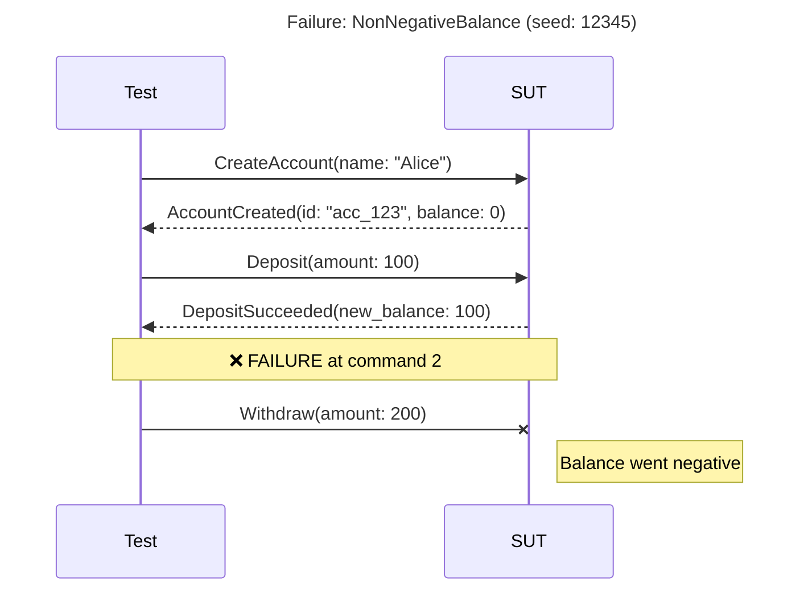

# PropertyDamage

*Controlled chaos from the outside in: break your systems before your users do it in prod.*

A stateful property-based testing (SPBT) framework for Elixir.

PropertyDamage generates random sequences of operations against your system and verifies that invariants hold throughout. When a failure is found, it automatically shrinks the sequence to the minimal reproduction case.

We want to thank [Bluecode](https://bluecode.com/en) for their support in developing and validating this framework.

## Features

- **Stateful Testing**: Generate sequences of commands, not just individual inputs
- **Automatic Shrinking**: Failed sequences are minimized to the smallest reproduction
- **Server-Generated Values**: Commands can reference `external()` results from earlier commands
- **Parallel Execution**: Branching sequences for race condition detection
- **Linearization Checking**: Verify parallel results are sequentially explainable
- **Idempotency Testing**: Built-in stutter testing for retry safety
- **Rich Failure Reports**: Comprehensive diagnostics when tests fail
- **Failure Persistence**: Save failures for later analysis and regression testing
- **Step-by-Step Replay**: Debug failures by executing commands one at a time
- **Seed Library**: Replay recently-failing seeds first; a self-pruning working set
- **Coverage Metrics**: Know how thoroughly your model is being exercised
- **Visual Diagrams**: Sequence diagrams in Mermaid, PlantUML, WebSequence formats
- **Run Comparison**: Compare full traces of the same plan to localize where passing and failing runs diverge
- **Failure Bisection**: `mix pd.bisect` drives `git bisect` to find the commit where a saved failure first reproduces
- **Failure Export Hub**: Convert failures to portable artifacts (scripts, tests, notebooks)
- **OpenAPI Scaffolding**: Generate command modules from API specifications
- **Fault Injection (Nemesis)**: Built-in operations for network, resource, time, and process faults
- **Differential Testing**: Compare implementations against oracles, baselines, or each other

## Installation

Add `property_damage` to your list of dependencies in `mix.exs`:

```elixir
def deps do
  [
    {:property_damage, "~> 0.2"},
    {:stream_data, "~> 1.0"}
  ]
end
```

(Your command generators call `StreamData` directly, so add it as a dependency too.)

## Quick Start

### 1. Define Events

Events represent the outcomes of operations. Fields the server generates
(like IDs) are marked with `external()` so PropertyDamage can track them
symbolically during generation and resolve them during execution:

```elixir
defmodule MyApp.Events do
  import PropertyDamage, only: [external: 0]

  defmodule UserCreated do
    # id is assigned by the System Under Test
    defstruct [:name, :email, id: external()]
  end
end
```

### 2. Define Commands

Commands are pure data generators. State-dependent logic (preconditions,
overrides) lives in the Model, not here:

```elixir
defmodule MyApp.Commands.CreateUser do
  use PropertyDamage.Command

  defstruct [:name, :email]

  @impl true
  def generator(overrides \\ %{}) do
    %{
      name: StreamData.string(:alphanumeric, min_length: 1, max_length: 20),
      email:
        StreamData.map(
          StreamData.string(:alphanumeric, min_length: 5),
          &"#{&1}@example.com"
        )
    }
    |> PropertyDamage.Generator.merge_overrides(overrides)
    |> StreamData.fixed_map()
  end
end
```

### 3. Define Projections and Invariants

Projections reduce events into state. Functions tagged with `@trigger`
are invariants, checked at the configured points:

```elixir
defmodule MyApp.Projections.Users do
  use PropertyDamage.Model.Projection

  alias MyApp.Events.UserCreated

  @impl true
  def init, do: %{users: %{}}

  @impl true
  def apply(state, %UserCreated{id: id, name: name, email: email}) do
    put_in(state, [:users, id], %{name: name, email: email})
  end

  def apply(state, _event), do: state

  # Checked after every command. Assert a property your SUT must never violate.
  # (Don't assert uniqueness of a client-supplied field like emails -- the
  # generator can legitimately repeat them; assert on what the SUT guarantees.)
  @trigger every: 1
  def assert_emails_present(state, _cmd_or_event) do
    if Enum.any?(state.users, fn {_id, u} -> u.email in [nil, ""] end) do
      PropertyDamage.fail!("user with missing email", users: state.users)
    end
  end
end
```

(`@trigger every: MyApp.Commands.CreateUser` runs a check only after that
command; see the [invariants guide](guides/writing_invariants.md) for more.)

### 4. Define a Simulator

During generation, no real system is available. The simulator predicts a
command's events so projections can build state for preconditions and
overrides; during execution, real events from the SUT take over:

```elixir
defmodule MyApp.Simulator do
  @behaviour PropertyDamage.Model.Simulator

  alias MyApp.Commands.CreateUser
  alias MyApp.Events.UserCreated

  @impl true
  def simulate(%CreateUser{name: name, email: email}, _state) do
    [%UserCreated{name: name, email: email}]
  end

  def simulate(_command, _state), do: []
end
```

### 5. Define a Model

The model ties everything together and owns the state-dependent logic:
selection weights, `when:` preconditions, and `with:` generator overrides:

```elixir
defmodule MyApp.TestModel do
  @behaviour PropertyDamage.Model

  @impl true
  def commands do
    [
      {MyApp.Commands.CreateUser, weight: 3}
      # {MyApp.Commands.DeleteUser,
      #  weight: 1,
      #  when: fn state -> map_size(state.users) > 0 end,
      #  with: fn state -> %{id: StreamData.member_of(Map.keys(state.users))} end}
    ]
  end

  @impl true
  def command_sequence_projection, do: MyApp.Projections.Users

  @impl true
  def assertion_projections, do: [MyApp.Projections.Users]

  @impl true
  def simulator, do: MyApp.Simulator
end
```

### 6. Define an Adapter

The adapter executes commands against your actual system and returns the
events that occurred:

```elixir
defmodule MyApp.TestAdapter do
  use PropertyDamage.Adapter

  alias MyApp.Commands.CreateUser
  alias MyApp.Events.UserCreated

  @impl true
  def setup(config), do: {:ok, config}

  @impl true
  def teardown(_context), do: :ok

  # In-memory SUT: mints a server-side id so the Quick Start runs with no
  # external service. To drive a real system, call it here (see below).
  @impl true
  def execute(%CreateUser{} = cmd, _context, _runtime) do
    id = "user_#{System.unique_integer([:positive])}"
    {:ok, [%UserCreated{id: id, name: cmd.name, email: cmd.email}]}
  end
end
```

To drive a **real HTTP service** instead, add an HTTP client (e.g. `{:req, "~> 0.5"}`)
and call it from `execute/3`:

```elixir
def execute(%CreateUser{} = cmd, context, _runtime) do
  body = Req.post!("#{context.base_url}/users", json: %{name: cmd.name, email: cmd.email}).body
  {:ok, [%UserCreated{id: body["id"], name: cmd.name, email: cmd.email}]}
end
```

### 7. Run Tests

```elixir
case PropertyDamage.run(
       model: MyApp.TestModel,
       adapter: MyApp.TestAdapter,
       max_commands: 50,
       max_runs: 100
     ) do
  {:ok, stats} ->
    IO.puts("#{stats.runs} runs passed (seed #{stats.seed})")

  {:error, failure} ->
    # A shrunk, minimal reproduction with full diagnostics
    IO.inspect(failure, pretty: true)
end
```

## Debugging Failures

When PropertyDamage finds a failure, it provides rich tools for understanding what went wrong.

### Understanding Failure Reports

```elixir
{:error, failure} = PropertyDamage.run(model: M, adapter: A)

# The shrunk, minimal reproduction with full diagnostics
IO.inspect(failure, pretty: true)

# Generate a reproducible test from it
test_code = PropertyDamage.generate_test(failure, format: :exunit)
File.write!("test/regression_test.exs", test_code)
```

### Interactive Shrinking

If the initial shrinking didn't produce a minimal sequence:

```elixir
# Try harder to shrink
{:ok, smaller} = PropertyDamage.shrink_further(failure,
  strategy: :exhaustive,
  max_time_ms: 120_000
)
```

Strategies:
- `:quick` - Fast, may miss some reductions
- `:thorough` - Balanced approach (default)
- `:exhaustive` - Try all possible reductions

### Step-by-Step Replay

Execute commands one at a time to see exactly what happens:

```elixir
{:ok, steps} = PropertyDamage.replay(failure)

for step <- steps do
  IO.puts("[#{step.index}] #{step.command_name}")
  IO.inspect(step.projections, label: "State after")

  case step.result do
    :ok -> IO.puts("  OK")
    {:check_failed, check, msg} -> IO.puts("  FAILED: #{msg}")
  end
end
```

For interactive debugging:

```elixir
alias PropertyDamage.Replay

{:ok, session} = Replay.start(failure)
{:ok, session, step1} = Replay.step(session)
IO.inspect(Replay.current_state(session))
{:ok, session, step2} = Replay.step(session)
# ... continue stepping
Replay.stop(session)
```

### Visual Debugging Tools

For complex failures, PropertyDamage provides visual tools to understand execution flow:

```elixir
# Generate a sequence diagram from a failure
diagram = PropertyDamage.Diagram.from_failure_report(failure, :mermaid)
IO.puts(diagram)  # Paste into GitHub markdown, Notion, etc.

# Compare full traces of the same plan to localize where the runs diverge
before = PropertyDamage.RunTrace.capture(model: MyModel, adapter: MyAdapter.Fixed, seed: failure.seed)
after_ = PropertyDamage.RunTrace.capture(model: MyModel, adapter: MyAdapter.Buggy, seed: failure.seed)
comparison = PropertyDamage.RunComparison.compare([before, after_])
IO.inspect(comparison.ranking)  # most discriminating field first
```

See [Visual Sequence Diagrams](#visual-sequence-diagrams) and [Run Comparison](#run-comparison) for detailed documentation.

## Failure Persistence

Save failures for later analysis or to build a regression suite:

```elixir
# Save a failure
{:error, failure} = PropertyDamage.run(model: M, adapter: A)
{:ok, path} = PropertyDamage.save_failure(failure, "failures/")
# => {:ok, "failures/20251226T143000-check_failed-UniqueEmails-seed512902757.pd"}

# Load and analyze later
{:ok, loaded} = PropertyDamage.load_failure(path)
{:ok, steps} = PropertyDamage.replay(loaded)

# List all saved failures
failures = PropertyDamage.list_failures("failures/", sort: :newest)

# Delete old failures
PropertyDamage.delete_failure(path)
```

## Seed Library

An ephemeral, self-pruning working set of recently-failing seeds that `run/1`
replays before random exploration, so a known-failing path is re-checked first
while you fix the bug. It is **not** a durable regression corpus: a seed only
reproduces while the model's generators are byte-stable, so for durable
regressions export to an ExUnit test instead. Each entry tracks a
consecutive-pass streak and is pruned automatically once it passes `K` times in
a row (default 3); flaky seeds keep failing and self-retain.

```elixir
# Enable the working set (default file). Previously-failing seeds replay first;
# if any still fail, exploration is skipped and the run halts with a summary.
# A new failure found during exploration is appended automatically.
PropertyDamage.run(model: M, adapter: A, seed_library: true)

# Or point at an explicit file, and tune the prune threshold:
PropertyDamage.run(model: M, adapter: A,
  seed_library: "seeds.json",
  seed_library_prune_after: 5
)
```

## Coverage Metrics

Track how thoroughly your model is being exercised:

```elixir
alias PropertyDamage.Coverage

# Single run coverage
result = PropertyDamage.run(model: M, adapter: A)
coverage = PropertyDamage.coverage(result, M)
IO.puts(Coverage.format(coverage))

# Track across multiple runs
tracker = Coverage.new(M)
tracker = Coverage.record(tracker, result1)
tracker = Coverage.record(tracker, result2)

# Check thresholds in CI
unless Coverage.meets_threshold?(tracker, command: 80, transition: 50) do
  raise "Coverage threshold not met!"
end

# Find untested commands
untested = Coverage.untested_commands(tracker)
```

### Format Options

Coverage supports multiple output formats:

```elixir
# Summary - basic stats
IO.puts(Coverage.format(tracker, :summary))

# Matrix - shows command transition coverage
IO.puts(Coverage.format(tracker, :matrix))

# Full - includes everything
IO.puts(Coverage.format(tracker, :full))

# State classes (when classifier is set)
IO.puts(Coverage.format(tracker, :state_classes))
```

### Transition Coverage

Track which command pairs (transitions) have been tested:

```elixir
# Get a transition matrix showing which A→B pairs were tested
matrix = Coverage.transition_matrix(tracker)
# => %{CreateAccount => %{CreateAccount => 5, CreditAccount => 12, DebitAccount => 8}, ...}

# Find untested transitions
untested = Coverage.untested_transitions(tracker)
# => [{CreateAccount, DeleteAccount}, {DebitAccount, CloseAccount}, ...]

# Get most frequent transitions
top = Coverage.top_transitions(tracker, 5)
# => [{{CreateAccount, CreditAccount}, 42}, {{CreditAccount, DebitAccount}, 38}, ...]
```

### State Class Coverage

For more meaningful coverage, define a state classifier to group concrete states into abstract classes:

```elixir
# Define a classifier function
classifier = fn state ->
  cond do
    state.accounts == %{} -> :no_accounts
    Enum.all?(state.accounts, fn {_, a} -> a.balance == 0 end) -> :all_zero_balance
    Enum.any?(state.accounts, fn {_, a} -> a.balance < 0 end) -> :has_negative
    true -> :has_positive
  end
end

# Create tracker with classifier
tracker = Coverage.new(MyModel, state_classifier: classifier)
tracker = Coverage.record(tracker, result1)
tracker = Coverage.record(tracker, result2)

# View state class distribution
counts = Coverage.state_class_counts(tracker)
# => %{no_accounts: 5, all_zero_balance: 12, has_positive: 83}

# View state class transitions (what state classes lead to what)
transitions = Coverage.state_class_transitions(tracker)
# => %{{:no_accounts, :all_zero_balance} => 5, {:all_zero_balance, :has_positive} => 10, ...}

# Get state class matrix for visualization
state_matrix = Coverage.state_class_matrix(tracker)

# Format with state class matrix
IO.puts(Coverage.format(tracker, :state_classes))
```

State class coverage helps answer: "Have we tested all interesting state configurations?"

## OpenAPI Scaffolding

Generate command modules from an OpenAPI specification:

```bash
# Generate from a local file
mix pd.scaffold --from openapi.json --output lib/my_app_test/commands/

# Generate from a URL
mix pd.scaffold --from https://api.example.com/openapi.json --output lib/

# Only specific operations
mix pd.scaffold --from openapi.json --operations createUser,updateUser

# Preview without writing
mix pd.scaffold --from openapi.json --dry-run
```

Generated commands include:
- Struct fields from request body schemas
- Type hints from OpenAPI types
- Placeholder generators based on field types
- Adapter execution hints

## Model Validation

Validate your model before running tests:

```bash
mix pd.validate --model MyApp.TestModel
```

This checks:
- All commands implement required callbacks
- Projections handle their declared events
- Checks reference valid projections
- No circular dependencies

## Configuration

### Run Options

```elixir
PropertyDamage.run(
  model: MyApp.TestModel,
  adapter: MyApp.TestAdapter,

  # Generation
  max_commands: 50,        # Max commands per sequence
  max_runs: 100,           # Number of test runs
  seed: 12345,             # Deterministic seed (optional)

  # Shrinking
  shrink_timeout_ms: 30_000,
  max_shrink_iterations: 1000,

  # Idempotency (see the idempotency guide)
  stutter: [probability: 0.1],

  # Adapter
  adapter_config: %{base_url: "http://localhost:4000"}
)
```

### Model Callbacks

```elixir
defmodule MyModel do
  @behaviour PropertyDamage.Model

  # Required
  def commands, do: [{CommandModule, weight: N}, ...]
  def command_sequence_projection, do: MyStateProjection
  def assertion_projections, do: [MyExtraProjection, ...]  # Optional

  # Optional
  def injectable_events, do: []  # For Adapter.Injector
  def simulator, do: MySimulatorModule  # Returns module implementing Simulator behaviour
  def setup_once(config), do: :ok
  def setup_each(config), do: :ok  # Called before each run/shrink attempt
  def teardown_each(config), do: :ok
  def teardown_once(config), do: :ok
  def terminate?(state, command, events), do: false  # Custom termination
end
```

## Parallel Execution

PropertyDamage supports branching sequences for detecting race conditions and
concurrent bugs. Commands can execute in parallel branches, and the framework
verifies that results are linearizable.

### Enabling Branching Sequences

```elixir
PropertyDamage.run(
  model: MyApp.TestModel,
  adapter: MyApp.TestAdapter,
  max_commands: 50,
  max_runs: 100,
  branching: [
    branch_probability: 0.3,   # Probability of creating branch points
    max_branches: 3,           # Max parallel branches
    max_branch_length: 5,      # Max commands per branch
    min_prefix_length: 3       # Min commands before branching
  ]
)
```

### How It Works

A branching sequence has three parts:

1. **Prefix**: Commands executed sequentially before branching
2. **Branches**: Parallel command lists executed concurrently
3. **Suffix**: Commands executed after branches merge

```
Prefix:  [cmd1, cmd2]
                |
       +--------+--------+
       |                 |
Branch A: [cmd3a, cmd4a] | Branch B: [cmd3b]
       |                 |
       +--------+--------+
                |
Suffix: [cmd5]
```

### Linearization Checking

After parallel execution, PropertyDamage verifies that the observed results
can be explained by some sequential ordering of the commands. If no valid
ordering exists, a `:linearization_failed` error is raised.

```elixir
alias PropertyDamage.Linearization

# Check complexity before verification
case Linearization.feasibility(branches) do
  :ok -> IO.puts("Manageable linearization space")
  {:warning, count} -> IO.puts("#{count} possible orderings")
end

# Count possible linearizations
count = Linearization.linearization_count([[cmd1, cmd2], [cmd3]])
# => 3 (possible orderings: [1,2,3], [1,3,2], [3,1,2])
```

### Shrinking Branching Sequences

The shrinker handles branching sequences with special strategies:

1. **Convert to linear**: If race not required for failure
2. **Remove branches**: Eliminate unnecessary parallel branches
3. **Shrink branches**: Remove commands within individual branches
4. **Shrink prefix/suffix**: Remove non-essential sequential commands

### Ref Constraints in Parallel Execution

Symbolic references follow strict rules in branching sequences:

- Refs from prefix can be used in any branch
- Refs from one branch **cannot** be used in another branch
- Refs from branches can be used in suffix

```elixir
# Valid: prefix ref used in branch
prefix = [CreateUser.new()]  # Creates :user_ref
branches = [[GetUser.new(user_ref: :user_ref)], [UpdateUser.new(user_ref: :user_ref)]]

# Invalid: cross-branch ref usage
branches = [[CreateItem.new()],  # Creates :item_ref
            [ViewItem.new(item_ref: :item_ref)]]  # ERROR: :item_ref not visible
```

## Eventual Consistency (Async Support)

For systems with eventual consistency, PropertyDamage provides probe and async
command semantics with automatic settle/retry logic.

### Command Semantics

Commands can declare their semantics via the `semantics/0` callback:

```elixir
defmodule MyTest.Commands.GetOrderStatus do
  @behaviour PropertyDamage.Command

  defstruct [:order_id]

  # This is a probe - it queries state and may need to retry
  def semantics, do: :probe

  # Configure settle behavior
  def settle_config do
    %{
      timeout_ms: 5_000,    # Max time to wait
      interval_ms: 200,     # Time between retries
      backoff: :exponential # :linear or :exponential
    }
  end

  def read_only?, do: true
end
```

### Semantics Types

| Semantics | Purpose | Settle Behavior |
|-----------|---------|-----------------|
| `:sync` | Mutates state (default) | Execute once |
| `:probe` | Queries state | Retry until success or timeout |
| `:async` | Waits for async completion | Retry until complete |

### Adapter Integration

Adapters return settle-compatible results for probes:

```elixir
def execute(%GetOrderStatus{order_id: id}, ctx) do
  case MyAPI.get_order(id) do
    {:ok, %{status: "pending"}} ->
      {:retry, :still_pending}  # Keep trying

    {:ok, order} ->
      {:ok, order}  # Success - stop retrying

    {:error, :not_found} ->
      {:retry, :not_found}  # Keep trying

    {:error, reason} ->
      {:error, reason}  # Hard failure - stop immediately
  end
end
```

See [Async and Eventual Consistency Guide](guides/async_and_eventual_consistency.md)
for complete documentation including bridge commands, `Adapter.Injector`, and
handling async operations that require polling.

## Fault Injection (Nemesis)

Test system resilience by injecting faults like network partitions, latency,
and node crashes.

### Defining a Nemesis Command

```elixir
defmodule MyTest.Nemesis.PartitionNetwork do
  @behaviour PropertyDamage.Nemesis

  defstruct [:partition_type, :duration_ms]

  @impl true
  def precondition(_state), do: true

  @impl true
  def inject(%__MODULE__{partition_type: type}, ctx) do
    :ok = Toxiproxy.partition(ctx.proxy, type)
    {:ok, [%NetworkPartitioned{type: type}]}
  end

  @impl true
  def restore(%__MODULE__{partition_type: type}, ctx) do
    Toxiproxy.restore(ctx.proxy, type)
    {:ok, [%NetworkRestored{type: type}]}
  end

  # Auto-restore after duration
  def auto_restore?, do: true
  def duration_ms(%__MODULE__{duration_ms: d}), do: d
end
```

### Using Nemesis in Models

Add nemesis commands with lower weights:

```elixir
def commands do
  [
    {CreateOrder, weight: 5},
    {ProcessPayment, weight: 3},
    {PartitionNetwork, weight: 1},   # Fault injection
    {InjectLatency, weight: 1}
  ]
end
```

### Built-in Nemesis Operations

PropertyDamage includes ready-to-use nemesis operations for common fault injection scenarios:

#### Network Operations

| Operation | Description |
|-----------|-------------|
| `NetworkLatency` | Add latency (50-500ms) with optional jitter |
| `NetworkPartition` | Block traffic (full, upstream, downstream) |
| `PacketLoss` | Drop percentage of packets (5-50%) |

```elixir
# Add network latency
alias PropertyDamage.Nemesis.NetworkLatency

def commands do
  [
    {CreateOrder, weight: 5},
    {NetworkLatency, weight: 1}  # Uses defaults: 100ms latency, 5s duration
  ]
end

# Or customize
%NetworkLatency{latency_ms: 200, jitter_ms: 50, duration_ms: 10_000}
```

> **Scope.** The built-in nemeses fault the SUT's *network path* only. They
> deliberately do not stress the local BEAM/host (CPU, memory, OS resources),
> kill local processes, or install a virtual clock: those affect the test
> harness's own VM rather than an external SUT driven through an adapter. To
> fault an in-process collaborator, do it in your own adapter/command code.

#### Integration with Toxiproxy

Network operations integrate with [Toxiproxy](https://github.com/Shopify/toxiproxy) when available:

```elixir
# Configure in adapter context
context = %{
  toxiproxy: %{
    proxy_name: "my_service",
    api_url: "http://localhost:8474"
  }
}

# Nemesis operations will automatically use Toxiproxy
# Falls back to simulated mode if not configured
```

> **Caveat — chaos is only as real as its backend.** Network operations
> (`NetworkPartition`, `PacketLoss`, `NetworkLatency`) require Toxiproxy to
> inject a real fault. Without it they currently fall back to a *simulated*
> mode that emits the fault event but injects nothing at the transport layer,
> so a test can pass with zero fault actually applied. Treat un-backed network
> nemesis as documentation, not evidence; the Redis bench's nemesis audit
> exercises each operation against a live SUT.

### Adjusting Invariants During Faults

```elixir
@trigger every: 1
def assert_latency_sla(state, _cmd_or_event) do
  # Skip SLA check during partition
  unless Map.get(state.active_faults, :network_partition) do
    unless state.last_latency_ms < 100 do
      PropertyDamage.fail!("SLA violated", latency_ms: state.last_latency_ms)
    end
  end
end
```

## Liveness Checking

Detect deadlocks, livelocks, and starvation with the Liveness projection.

### Configuration

```elixir
defmodule MyModel do
  def assertion_projections do
    [
      {PropertyDamage.Model.Projection.Liveness, [
        max_pending_duration_ms: 10_000,
        check_interval: 10,
        required_completions: %{
          CreateTransfer => [TransferCompleted, TransferFailed],
          CreateOrder => [OrderConfirmed, OrderRejected]
        }
      ]}
    ]
  end
end
```

### How It Works

1. **Track starts**: When `CreateTransfer` executes, mark operation as pending
2. **Track completions**: When `TransferCompleted` or `TransferFailed` arrives, mark complete
3. **Check timeouts**: Periodically check for operations pending too long
4. **Report stuck**: If any operation exceeds `max_pending_duration_ms`, fail

### What It Detects

| Issue | Symptom |
|-------|---------|
| Deadlock | Operations never complete |
| Livelock | System busy but no progress |
| Starvation | Some operations always timeout |

## Visual Sequence Diagrams

Generate sequence diagrams from failure reports to visualize command flows and pinpoint failures.

### Supported Formats

| Format | Description | Use Case |
|--------|-------------|----------|
| `:mermaid` | Mermaid syntax | GitHub, GitLab, Notion |
| `:plantuml` | PlantUML syntax | Enterprise docs, IDE plugins |
| `:websequence` | sequencediagram.org | Quick sharing |

### Basic Usage

```elixir
# From a failure report
{:error, report} = PropertyDamage.run(model: MyModel, adapter: MyAdapter)
diagram = PropertyDamage.Diagram.from_failure_report(report, :mermaid)
IO.puts(diagram)

# From sequence and event log
diagram = PropertyDamage.Diagram.generate(sequence, event_log, :plantuml,
  title: "Account Creation Flow",
  highlight_failure: true
)

# Save to file
PropertyDamage.Diagram.save(diagram, "failure_diagram", :mermaid)
# Creates: failure_diagram.md
```

### Example Output (Mermaid)



### Options

- `:title` - Custom diagram title
- `:show_state` - Include state participant
- `:max_value_length` - Truncate long values (default: 50)
- `:highlight_failure` - Visual failure markers (default: true)

## Run Comparison

Compare full traces of the **same plan** and localize where their executions
diverge, ranking field differences by how strongly they discriminate the
outcomes. This targets two use cases: **regression localization** (a plan passed
on one revision of the SUT and fails on another) and **flakiness localization**
(a plan fails one time in N). Both need full, unshrunk, same-plan runs, which is
what `PropertyDamage.RunTrace.capture/1` produces and a `FailureReport` (a shrunk
sequence) is not.

Capture is `RunTrace`'s job; comparison is `RunComparison`'s. The comparator is
pure data-in/data-out and never runs a SUT.

### Comparing Traces

```elixir
alias PropertyDamage.{RunTrace, RunComparison}

# Same model and seed on both sides ⇒ identical plan (comparable by fingerprint).
before = RunTrace.capture(model: M, adapter: A.Fixed, seed: 123)
after_ = RunTrace.capture(model: M, adapter: A.Buggy, seed: 123)

comparison = RunComparison.compare([before, after_])

if comparison.comparable? do
  IO.inspect(comparison.groups)   # %{passing: [...], failing: [...]} (by index)
  IO.inspect(comparison.ranking)  # ranked %Field{}s, most discriminating first
else
  IO.inspect(comparison.guard_violations)
end
```

`compare/1` refuses (returns `comparable?: false` with `guard_violations`) rather
than emit a misleading diff when the traces are not the same plan (unequal plan
fingerprint or model).

### Reading the Ranking

Each ranked entry is a `%RunComparison.Field{}` with a `location`
(`{:command, position, path}` or `{:event, ...}`), a `classification`, a
`provenance`, and `values` (a `%{trace_index => value}` map):

| Classification | Meaning |
|----------------|---------|
| `:discriminating` | Stable within each outcome group but different between groups — the likely cause |
| `:incidental` | Varies even within the passing group (e.g. run-scoped correlation ids) — down-ranked |
| `:weak` | Differs, but does not cleanly separate the groups |
| `:comparability_violation` | A plan-generated field differs where the plan should be identical |

### Flakiness Localization

Run comparison is also the flakiness tool. `RunComparison.investigate/1` captures
the traces for you for a single suspect seed. Its capture options are nested under
a `capture:` sub-keyword, and a fresh `run_nonce` is drawn per capture so
client-minted values never collide on a shared SUT:

```elixir
{_traces, comparison} =
  RunComparison.investigate(
    runs: 10,
    capture: [model: M, adapter: A, seed: 123]
  )
```

To scan a whole corpus of seeds, `RunComparison.scan/1` runs each seed N times
and returns a per-seed `%RunComparison.Verdict{}` (bounded memory: a seed's
traces are discarded before the next, and only flaky seeds keep their full
comparison):

```elixir
verdicts = RunComparison.scan(seeds: Enum.to_list(1..100), runs: 5, capture: [model: M, adapter: A])
flaky = for {seed, v} <- verdicts, v.flaky?, do: seed
```

### HTML Report

```elixir
File.write!("comparison.html", RunComparison.to_html(comparison))
```

A single self-contained HTML file: inline CSS/JS, no external hosts, readable
with JavaScript disabled, carrying an embedded machine-readable JSON blob.

Run comparison requires generation to be a pure function of the seed so both
sides regenerate the identical plan; see the
[deterministic generation guide](guides/deterministic_generation.md).

## Failure Export Hub

Convert failure reports into portable artifacts for sharing, regression testing, and interactive exploration.

### Export Formats

| Format | Output | Use Case |
|--------|--------|----------|
| ExUnit | `.exs` test file | CI regression protection |
| Elixir Script | `.exs` standalone | Elixir developers |
| Bash/curl Script | `.sh` with curl | Any developer with a shell |
| Python Script | `.py` with requests | Python teams |
| LiveBook | `.livemd` notebook | Interactive debugging |

### Basic Usage

```elixir
{:error, failure} = PropertyDamage.run(model: MyModel, adapter: MyAdapter)

# Generate ExUnit regression test
test_code = PropertyDamage.Export.to_exunit(failure)
File.write!("test/regressions/seed_#{failure.seed}_test.exs", test_code)

# Generate standalone scripts
elixir_script = PropertyDamage.Export.to_script(failure, :elixir,
  base_url: "http://localhost:4000",
  adapter: MyHTTPAdapter
)

curl_script = PropertyDamage.Export.to_script(failure, :curl,
  base_url: "http://localhost:4000",
  adapter: MyHTTPAdapter
)

python_script = PropertyDamage.Export.to_script(failure, :python,
  base_url: "http://localhost:4000",
  adapter: MyHTTPAdapter
)

# Generate LiveBook notebook
notebook = PropertyDamage.Export.to_livebook(failure,
  base_url: "http://localhost:4000",
  adapter: MyHTTPAdapter
)
```

### File Operations

```elixir
# Save single format
{:ok, path} = PropertyDamage.Export.save(failure, "exports/", :exunit)
# => {:ok, "exports/reproduce_512902757.exs"}

{:ok, path} = PropertyDamage.Export.save(failure, "exports/", {:script, :curl},
  base_url: "http://localhost:4000",
  adapter: MyHTTPAdapter
)
# => {:ok, "exports/reproduce_512902757.sh"}

# Save all formats at once
{:ok, paths} = PropertyDamage.Export.save_all(failure, "exports/",
  base_url: "http://localhost:4000",
  adapter: MyHTTPAdapter,
  script_languages: [:elixir, :curl, :python]
)
# => {:ok, %{
#   exunit: "exports/reproduce_512902757.exs",
#   livebook: "exports/reproduce_512902757.livemd",
#   script_elixir: "exports/reproduce_512902757.exs",
#   script_curl: "exports/reproduce_512902757.sh",
#   script_python: "exports/reproduce_512902757.py"
# }}
```

### HTTPSpec for Script Generation

For scripts to make HTTP calls, your adapter needs to implement `http_spec/2`:

```elixir
defmodule MyHTTPAdapter do
  @behaviour PropertyDamage.Adapter

  alias PropertyDamage.Export.HTTPSpec

  # Standard adapter callbacks...
  def execute(cmd, ctx), do: # ...

  # Optional: HTTP mapping for export
  def http_spec(%CreateAccount{currency: curr}, _ctx) do
    %HTTPSpec{
      method: :post,
      path: "/api/accounts",
      body: %{currency: curr}
    }
  end

  def http_spec(%CreditAccount{account_ref: ref, amount: amt}, _ctx) do
    %HTTPSpec{
      method: :post,
      path: "/api/accounts/:account_id/credit",
      path_params: %{account_id: ref},
      body: %{amount: amt}
    }
  end

  def http_spec(%DebitAccount{account_ref: ref, amount: amt}, _ctx) do
    %HTTPSpec{
      method: :post,
      path: "/api/accounts/:account_id/debit",
      path_params: %{account_id: ref},
      body: %{amount: amt}
    }
  end
end
```

### LiveBook Features

Generated LiveBook notebooks include:

- **Setup section**: Installs dependencies (Req, Jason)
- **State tracking**: Tracks refs and model state alongside execution
- **Step-by-step commands**: Each command in its own cell with HTTP call
- **Failure marker**: Highlights the command that caused the failure
- **Exploration section**: Space to experiment with variations

```elixir
# Exclude exploration section if not needed
notebook = PropertyDamage.Export.to_livebook(failure,
  base_url: "http://localhost:4000",
  adapter: MyHTTPAdapter,
  include_exploration: false
)
```

### Example Generated Script (curl)

```bash
#!/bin/bash
# Failure Reproduction Script
# Generated: 2025-12-26T14:30:00Z
# Failure: NonNegativeBalance check failed
# Seed: 512902757

set -e
BASE_URL="${BASE_URL:-http://localhost:4000}"

echo "=== Step 1: CreateAccount ==="
RESP1=$(curl -s -X POST "$BASE_URL/api/accounts" \
  -H "Content-Type: application/json" \
  -d '{"currency": "USD"}')
echo "$RESP1"
REF_account_0=$(echo "$RESP1" | jq -r '.data.id // .id // empty')

echo "=== Step 2: CreditAccount ==="
RESP2=$(curl -s -X POST "$BASE_URL/api/accounts/$REF_account_0/credit" \
  -H "Content-Type: application/json" \
  -d '{"amount": 100}')
echo "$RESP2"

echo "=== Step 3: DebitAccount (FAILURE POINT) ==="
RESP3=$(curl -s -X POST "$BASE_URL/api/accounts/$REF_account_0/debit" \
  -H "Content-Type: application/json" \
  -d '{"amount": 200}')
echo "$RESP3"
```

## Automatic Regression Management

Automatically save failures to seed libraries and generate regression tests when bugs are found.

### Basic Usage

Use the `:regression` option in `PropertyDamage.run/1`:

```elixir
PropertyDamage.run(
  model: MyModel,
  adapter: MyAdapter,
  regression: [
    save_failures: "failures/",           # Save failure files
    seed_library: "seeds.json",           # Add to seed library
    generate_tests: "test/regressions/",  # Generate ExUnit tests
    tags: [:auto_detected],               # Tags for seed library
    dedup: true                           # Skip similar failures
  ]
)
```

When a failure is found, PropertyDamage will automatically:
1. Save the failure file to the specified directory
2. Add the seed to your seed library
3. Generate an ExUnit regression test

### Deduplication

Avoid noise from multiple runs finding the same bug:

```elixir
PropertyDamage.run(
  model: MyModel,
  adapter: MyAdapter,
  regression: [
    save_failures: "failures/",
    dedup: true,                 # Enable deduplication
    dedup_threshold: 0.90        # 90% similarity threshold
  ]
)
```

### Using Handlers Directly

For more control, use handlers with `:on_failure`:

```elixir
alias PropertyDamage.Regression

# Single handler
PropertyDamage.run(
  model: MyModel,
  adapter: MyAdapter,
  on_failure: Regression.save_failure("failures/")
)

# Compose multiple handlers
PropertyDamage.run(
  model: MyModel,
  adapter: MyAdapter,
  on_failure: Regression.compose([
    Regression.save_failure("failures/"),
    Regression.add_to_library("seeds.json", tags: [:critical]),
    fn report -> Logger.warning("Failure found: #{report.seed}") end
  ])
)
```

### Batch Processing

Process multiple failures at once with deduplication:

```elixir
failures = [failure1, failure2, failure3]

results = PropertyDamage.Regression.process_batch(failures,
  seed_library: "seeds.json",
  dedup: true,
  dedup_threshold: 0.90
)

summary = PropertyDamage.Regression.batch_summary(results)
IO.puts(PropertyDamage.Regression.format_batch_summary(summary))
```

### Options

| Option | Description |
|--------|-------------|
| `:save_failures` | Directory to save failure files |
| `:seed_library` | Path to seed library JSON file |
| `:generate_tests` | Directory for ExUnit test files |
| `:tags` | Tags for seed library entries (default: `[:auto_detected]`) |
| `:description` | Description for seed library entries |
| `:dedup` | Enable deduplication (default: false) |
| `:dedup_threshold` | Similarity threshold (default: 0.90) |
| `:dedup_source` | Where to check: `:failures`, `:library`, or `:both` |
| `:verbose` | Print actions taken (default: false) |

## Differential Testing

Compare multiple implementations by running the same command sequences against them.
Use cases include oracle testing, performance comparison, migration validation, and
regression testing.

### Basic Usage

```elixir
# Oracle testing - compare against reference implementation
PropertyDamage.Differential.run(
  model: MyModel,
  targets: [
    {ReferenceAdapter, role: :reference},
    {SUTAdapter, name: "new-impl"}
  ],
  compare: :correctness,
  max_runs: 100
)

# Performance comparison
PropertyDamage.Differential.run(
  model: MyModel,
  targets: [
    {RedisAdapter, name: "redis-backend"},
    {PostgresAdapter, name: "postgres-backend"}
  ],
  compare: :performance
)

# Same adapter, different configurations (e.g., staging vs prod)
PropertyDamage.Differential.run(
  model: MyModel,
  targets: [
    {HTTPAdapter, role: :reference, opts: [base_url: "https://prod.example.com"]},
    {HTTPAdapter, name: "staging", opts: [base_url: "https://staging.example.com"]}
  ],
  compare: :correctness
)
```

### Time-Separated Comparison

Save results now, compare later:

```elixir
# Export baseline before deployment
PropertyDamage.Differential.run(
  model: MyModel,
  targets: [{ProdAdapter, name: "v2.3"}],
  compare: :performance,
  export_to: "baselines/v2.3.json",
  seed: 12345
)

# Compare against baseline after deployment
PropertyDamage.Differential.run(
  model: MyModel,
  targets: [{ProdAdapter, name: "v2.4"}],
  compare: :performance,
  baseline: "baselines/v2.3.json"
)
```

### Equivalence Strategies

```elixir
# Exact matching (default)
compare: :correctness, equivalence: :exact

# Structural - ignores IDs, timestamps, UUIDs
compare: :correctness, equivalence: :structural

# Custom comparison function
compare: :correctness, equivalence: fn ref, target ->
  ref.status == target.status && ref.amount == target.amount
end
```

See [Differential Testing Guide](guides/differential_testing.md) for complete documentation.

## Benches

The `benches/` directory holds self-contained mix projects that drive
PropertyDamage against real third-party software. Each is a standalone project
(`{:property_damage, path: "../.."}`) with its own README, and every bench is
CI-gated. They double as runnable, end-to-end examples:

### cachex_bench

PropertyDamage against [Cachex](https://hex.pm/packages/cachex) in-process (no
external infra). A good first read: consistency invariants + shrinking on an
in-BEAM SUT.

```
benches/cachex_bench/
```

### openapi_bench

A `mix pd.scaffold`-generated HTTP client driving a tiny in-process REST API (no
Docker). Demonstrates the scaffold codegen path, stutter/idempotency, and the
integration-testing workflow (see the [Integration Testing
guide](guides/integration_testing.md)).

```
benches/openapi_bench/
```

### oban_bench

[Oban](https://hex.pm/packages/oban) on real Postgres: the eventual-consistency
rung (`@poll_state`, pollers, `external()` job ids). Provisions Postgres via
Docker.

```
benches/oban_bench/
```

### redis_bench

[Redis](https://redis.io) over the network with live [Toxiproxy](https://github.com/Shopify/toxiproxy)
fault injection: the external-SUT + nemesis rung. Provisions via Docker.

```
benches/redis_bench/
```

### gitea_bench

[Gitea](https://about.gitea.com) driven two ways (REST + Playwright UI) and
compared by a differential oracle: the dual-transport rung. Provisions via
Docker.

```
benches/gitea_bench/
```

## Guides

The full set of guides (getting started, writing commands and invariants,
debugging, chaos engineering, differential and dual-transport testing, and more)
is browsable in the `guides/` directory and rendered on
[HexDocs](https://hexdocs.pm/property_damage). New here? Start with
[Getting Started](guides/getting_started.md).

## Architecture

```
PropertyDamage
├── Core Types (Tier 0)
│   ├── Command      - Operation behaviour
│   ├── Model        - Test model behaviour
│   │   ├── Projection   - State reducer behaviour
│   │   └── Simulator    - Symbolic execution behaviour
│   └── Sequence     - Linear and branching command sequences
│
├── Execution (Tier 1)
│   ├── Adapter      - SUT bridge behaviour
│   │   └── Injector - External event injection behaviour
│   ├── Executor     - Command execution (linear and parallel)
│   ├── Linearization - Parallel execution verification
│   ├── Settle       - Probe/async retry for eventual consistency
│   ├── Nemesis      - Fault injection behaviour + built-in operations
│   └── EventQueue   - Event coordination
│
├── Shrinking (Tier 2)
│   ├── Shrinker     - Sequence minimization (supports branching)
│   ├── Validator    - Sequence validation
│   └── Graph        - Dependency analysis
│
├── Diagnostics
│   ├── FailureReport - Structured failure + formatter
│   ├── Replay       - Step-by-step execution
│   ├── Coverage     - Metrics tracking
│   ├── Diagram      - Visual sequence diagrams
│   ├── RunTrace     - Full outcome-neutral record of one run
│   └── RunComparison - Same-plan trace comparison and divergence ranking
│
├── Export
│   ├── Export       - Main API (to_exunit, to_script)
│   ├── HTTPSpec     - HTTP call description struct
│   ├── ExUnit       - ExUnit test generation
│   └── Script       - Elixir / curl / Python scripts
│
├── Differential
│   ├── Differential - Main API (run, compare modes)
│   ├── Equivalence  - Comparison strategies (exact, structural, custom)
│   └── Baseline     - Export/import for time-separated testing
│
└── Utilities
    ├── Persistence  - Save/load failures
    ├── SeedLibrary  - Seed management
    ├── Regression   - Automatic regression test management
    └── Scaffold     - OpenAPI code generation
```

> The codebase also ships several modules that are **work in progress and not
> fully supported at this time**, intentionally left out of this README and the
> docs front page: invariant suggestions, failure intelligence
> (clustering/verification), production forensics, and Livebook visualization.
> They compile and have moduledocs, but have not been validated against a real
> SUT yet. Use them at your own risk.

## License

Apache License 2.0. See LICENSE for details.
