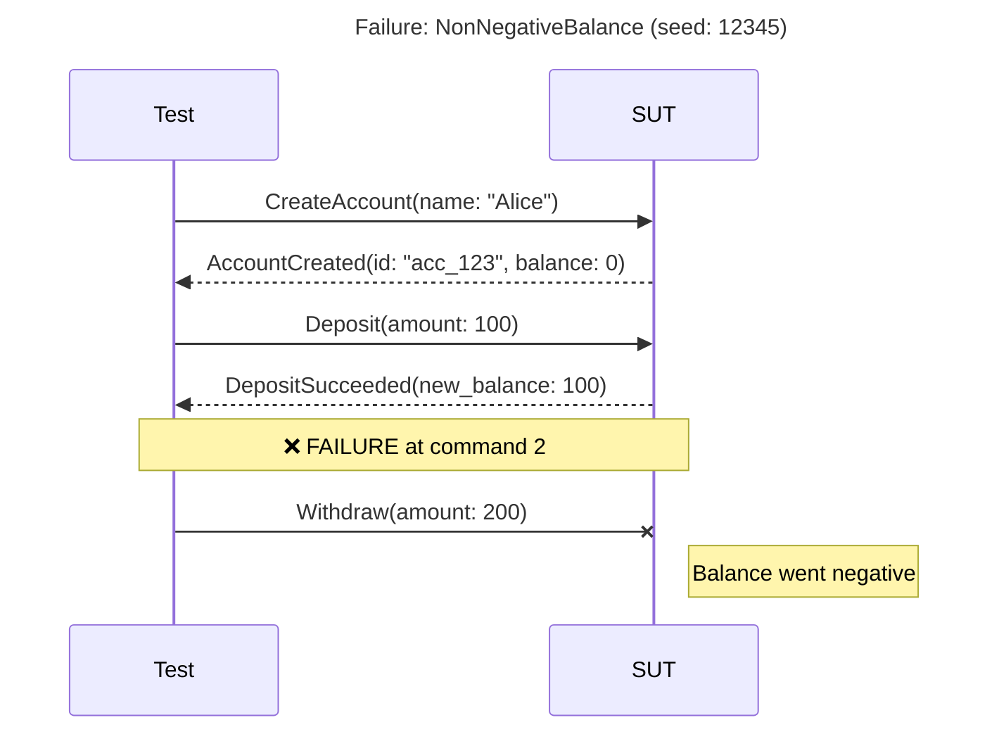

# PropertyDamage

A stateful property-based testing (SPBT) framework for Elixir.

PropertyDamage generates random sequences of operations against your system and verifies that invariants hold throughout. When a failure is found, it automatically shrinks the sequence to the minimal reproduction case.

## Features

- **Stateful Testing**: Generate sequences of commands, not just individual inputs
- **Automatic Shrinking**: Failed sequences are minimized to the smallest reproduction
- **Symbolic References**: Commands can reference results from earlier commands
- **Parallel Execution**: Branching sequences for race condition detection
- **Linearization Checking**: Verify parallel results are sequentially explainable
- **Idempotency Testing**: Built-in stutter testing for retry safety
- **Rich Failure Reports**: Comprehensive diagnostics when tests fail
- **Failure Persistence**: Save failures for later analysis and regression testing
- **Step-by-Step Replay**: Debug failures by executing commands one at a time
- **Seed Library**: Track and share interesting seeds across your team
- **Coverage Metrics**: Know how thoroughly your model is being exercised
- **Flakiness Detection**: Identify non-deterministic behavior in your SUT
- **Load Testing**: Generate realistic load using SPBT traffic patterns
- **Visual Diagrams**: Sequence diagrams in Mermaid, PlantUML, WebSequence formats
- **Diff Debugging**: Compare passing vs failing runs to find divergence
- **OpenAPI Scaffolding**: Generate command modules from API specifications

## Installation

Add `property_damage` to your list of dependencies in `mix.exs`:

```elixir
def deps do
  [
    {:property_damage, "~> 0.1.0"}
  ]
end
```

## Quick Start

### 1. Define Commands

Commands represent operations that can be executed against your system:

```elixir
defmodule MyApp.Commands.CreateUser do
  use PropertyDamage.Command

  defstruct [:name, :email]

  @impl true
  def new!(state, generators) do
    %__MODULE__{
      name: Faker.Person.name(),
      email: Faker.Internet.email()
    }
  end

  @impl true
  def precondition(_state), do: true

  @impl true
  def events(command, response) do
    [%MyApp.Events.UserCreated{
      id: response["id"],
      name: command.name,
      email: command.email
    }]
  end

  @impl true
  def ref(_command, response), do: response["id"]
end
```

### 2. Define Projections

Projections maintain state by processing events:

```elixir
defmodule MyApp.Projections.Users do
  use PropertyDamage.Projection

  def init, do: %{}

  def handles?(%MyApp.Events.UserCreated{}), do: true
  def handles?(_), do: false

  def apply(state, %MyApp.Events.UserCreated{} = event) do
    Map.put(state, event.id, %{name: event.name, email: event.email})
  end

  def observables(state), do: %{users: state, count: map_size(state)}
end
```

### 3. Define Checks (Invariants)

Checks verify that invariants hold after each command:

```elixir
defmodule MyApp.Checks.UniqueEmails do
  use PropertyDamage.Check

  def projection, do: MyApp.Projections.Users

  def check(%{users: users}) do
    emails = Map.values(users) |> Enum.map(& &1.email)
    if length(emails) == length(Enum.uniq(emails)) do
      :ok
    else
      {:error, "Duplicate emails found"}
    end
  end
end
```

### 4. Define a Model

The model ties everything together:

```elixir
defmodule MyApp.TestModel do
  use PropertyDamage.Model

  def commands do
    [
      {10, MyApp.Commands.CreateUser},
      {5, MyApp.Commands.UpdateUser},
      {3, MyApp.Commands.DeleteUser}
    ]
  end

  def projections do
    [MyApp.Projections.Users]
  end

  def checks do
    [MyApp.Checks.UniqueEmails]
  end
end
```

### 5. Define an Adapter

The adapter executes commands against your actual system:

```elixir
defmodule MyApp.TestAdapter do
  @behaviour PropertyDamage.Adapter

  @impl true
  def execute(%MyApp.Commands.CreateUser{} = cmd, config) do
    Req.post!("#{config.base_url}/users", json: %{
      name: cmd.name,
      email: cmd.email
    }).body
  end

  # ... other commands
end
```

### 6. Run Tests

```elixir
PropertyDamage.run(
  model: MyApp.TestModel,
  adapter: MyApp.TestAdapter,
  adapter_config: %{base_url: "http://localhost:4000"},
  max_commands: 50,
  max_runs: 100
)
```

## Debugging Failures

When PropertyDamage finds a failure, it provides rich tools for understanding what went wrong.

### Understanding Failure Reports

```elixir
{:error, failure} = PropertyDamage.run(model: M, adapter: A)

# Get a quick explanation
explanation = PropertyDamage.explain(failure)
IO.puts(PropertyDamage.Analysis.format_explanation(explanation))

# Find what triggered the failure
{:ok, trigger} = PropertyDamage.isolate_trigger(failure)
IO.puts("Cause: #{trigger.likely_cause}")

# Generate a reproducible test
test_code = PropertyDamage.generate_test(failure, format: :exunit)
File.write!("test/regression_test.exs", test_code)
```

### Interactive Shrinking

If the initial shrinking didn't produce a minimal sequence:

```elixir
# Try harder to shrink
{:ok, smaller} = PropertyDamage.shrink_further(failure,
  strategy: :exhaustive,
  max_time_ms: 120_000
)
```

Strategies:
- `:quick` - Fast, may miss some reductions
- `:thorough` - Balanced approach (default)
- `:exhaustive` - Try all possible reductions

### Step-by-Step Replay

Execute commands one at a time to see exactly what happens:

```elixir
{:ok, steps} = PropertyDamage.replay(failure)

for step <- steps do
  IO.puts("[#{step.index}] #{step.command_name}")
  IO.inspect(step.projections, label: "State after")

  case step.result do
    :ok -> IO.puts("  OK")
    {:check_failed, check, msg} -> IO.puts("  FAILED: #{msg}")
  end
end
```

For interactive debugging:

```elixir
alias PropertyDamage.Replay

{:ok, session} = Replay.start(failure)
{:ok, session, step1} = Replay.step(session)
IO.inspect(Replay.current_state(session))
{:ok, session, step2} = Replay.step(session)
# ... continue stepping
Replay.stop(session)
```

## Failure Persistence

Save failures for later analysis or to build a regression suite:

```elixir
# Save a failure
{:error, failure} = PropertyDamage.run(model: M, adapter: A)
{:ok, path} = PropertyDamage.save_failure(failure, "failures/")
# => {:ok, "failures/20251226T143000-check_failed-UniqueEmails-seed512902757.pd"}

# Load and analyze later
{:ok, loaded} = PropertyDamage.load_failure(path)
{:ok, steps} = PropertyDamage.replay(loaded)

# List all saved failures
failures = PropertyDamage.list_failures("failures/", sort: :newest)

# Delete old failures
PropertyDamage.delete_failure(path)
```

## Seed Library

Track seeds that have found bugs for regression testing:

```elixir
# Create or load a seed library
{:ok, library} = PropertyDamage.load_seed_library("seeds.json")

# Add a failure to the library
{:error, failure} = PropertyDamage.run(model: M, adapter: A)
{:ok, library} = PropertyDamage.add_to_seed_library(library, failure,
  tags: [:currency, :capture],
  description: "Currency mismatch in capture"
)

# Save the library
PropertyDamage.save_seed_library(library, "seeds.json")

# Get seeds to run in CI
alias PropertyDamage.SeedLibrary
failing_seeds = SeedLibrary.seed_values(library, status: :failing)

# Update status after running
library = SeedLibrary.record_run(library, seed, failed: false)

# View statistics
IO.puts(SeedLibrary.format(library))
```

## Coverage Metrics

Track how thoroughly your model is being exercised:

```elixir
alias PropertyDamage.Coverage

# Single run coverage
result = PropertyDamage.run(model: M, adapter: A)
coverage = PropertyDamage.coverage(result, M)
IO.puts(Coverage.format(coverage))

# Track across multiple runs
tracker = Coverage.new(M)
tracker = Coverage.record(tracker, result1)
tracker = Coverage.record(tracker, result2)

# Check thresholds in CI
unless Coverage.meets_threshold?(tracker, command: 80, transition: 50) do
  raise "Coverage threshold not met!"
end

# Find untested commands
untested = Coverage.untested_commands(tracker)
```

## Flakiness Detection

Detect non-deterministic behavior in your system:

```elixir
# Check if a specific seed is flaky
case PropertyDamage.check_determinism(M, A, 512902757, runs: 10) do
  {:ok, :deterministic} ->
    IO.puts("Seed produces consistent results")

  {:ok, :flaky, stats} ->
    IO.puts("FLAKY: passed #{stats.passes}/#{stats.runs} times")
    IO.puts("Variance type: #{stats.variance_type}")
end

# Discover flaky seeds
flaky_seeds = PropertyDamage.discover_flaky_seeds(M, A,
  num_seeds: 20,
  runs_per_seed: 5,
  verbose: true
)
```

## OpenAPI Scaffolding

Generate command modules from an OpenAPI specification:

```bash
# Generate from a local file
mix pd.scaffold --from openapi.json --output lib/my_app_test/commands/

# Generate from a URL
mix pd.scaffold --from https://api.example.com/openapi.json --output lib/

# Only specific operations
mix pd.scaffold --from openapi.json --operations createUser,updateUser

# Preview without writing
mix pd.scaffold --from openapi.json --dry-run
```

Generated commands include:
- Struct fields from request body schemas
- Type hints from OpenAPI types
- Placeholder generators based on field types
- Adapter execution hints

## Model Validation

Validate your model before running tests:

```bash
mix pd.validate --model MyApp.TestModel
```

This checks:
- All commands implement required callbacks
- Projections handle their declared events
- Checks reference valid projections
- No circular dependencies

## Configuration

### Run Options

```elixir
PropertyDamage.run(
  model: MyApp.TestModel,
  adapter: MyApp.TestAdapter,

  # Generation
  max_commands: 50,        # Max commands per sequence
  max_runs: 100,           # Number of test runs
  seed: 12345,             # Deterministic seed (optional)

  # Shrinking
  shrink_timeout_ms: 30_000,
  max_shrink_iterations: 1000,

  # Idempotency
  stutter_probability: 0.1,  # Retry probability

  # Adapter
  adapter_config: %{base_url: "http://localhost:4000"}
)
```

### Model Callbacks

```elixir
defmodule MyModel do
  use PropertyDamage.Model

  # Required
  def commands, do: [{weight, CommandModule}, ...]
  def projections, do: [ProjectionModule, ...]
  def checks, do: [CheckModule, ...]

  # Optional
  def setup_all(config), do: :ok
  def setup_each(config), do: :ok  # Called before each run/shrink attempt
  def teardown_each(config), do: :ok
  def teardown_all(config), do: :ok
end
```

## Parallel Execution

PropertyDamage supports branching sequences for detecting race conditions and
concurrent bugs. Commands can execute in parallel branches, and the framework
verifies that results are linearizable.

### Enabling Branching Sequences

```elixir
PropertyDamage.run(
  model: MyApp.TestModel,
  adapter: MyApp.TestAdapter,
  max_commands: 50,
  max_runs: 100,
  branching: [
    branch_probability: 0.3,   # Probability of creating branch points
    max_branches: 3,           # Max parallel branches
    max_branch_length: 5,      # Max commands per branch
    min_prefix_length: 3       # Min commands before branching
  ]
)
```

### How It Works

A branching sequence has three parts:

1. **Prefix**: Commands executed sequentially before branching
2. **Branches**: Parallel command lists executed concurrently
3. **Suffix**: Commands executed after branches merge

```
Prefix:  [cmd1, cmd2]
                |
       +--------+--------+
       |                 |
Branch A: [cmd3a, cmd4a] | Branch B: [cmd3b]
       |                 |
       +--------+--------+
                |
Suffix: [cmd5]
```

### Linearization Checking

After parallel execution, PropertyDamage verifies that the observed results
can be explained by some sequential ordering of the commands. If no valid
ordering exists, a `:linearization_failed` error is raised.

```elixir
alias PropertyDamage.Linearization

# Check complexity before verification
case Linearization.feasibility(branches) do
  :ok -> IO.puts("Manageable linearization space")
  {:warning, count} -> IO.puts("#{count} possible orderings")
end

# Count possible linearizations
count = Linearization.linearization_count([[cmd1, cmd2], [cmd3]])
# => 3 (possible orderings: [1,2,3], [1,3,2], [3,1,2])
```

### Shrinking Branching Sequences

The shrinker handles branching sequences with special strategies:

1. **Convert to linear**: If race not required for failure
2. **Remove branches**: Eliminate unnecessary parallel branches
3. **Shrink branches**: Remove commands within individual branches
4. **Shrink prefix/suffix**: Remove non-essential sequential commands

### Ref Constraints in Parallel Execution

Symbolic references follow strict rules in branching sequences:

- Refs from prefix can be used in any branch
- Refs from one branch **cannot** be used in another branch
- Refs from branches can be used in suffix

```elixir
# Valid: prefix ref used in branch
prefix = [CreateUser.new()]  # Creates :user_ref
branches = [[GetUser.new(user_ref: :user_ref)], [UpdateUser.new(user_ref: :user_ref)]]

# Invalid: cross-branch ref usage
branches = [[CreateItem.new()],  # Creates :item_ref
            [ViewItem.new(item_ref: :item_ref)]]  # ERROR: :item_ref not visible
```

## Eventual Consistency (Async Support)

For systems with eventual consistency, PropertyDamage provides probe and bridge
command roles with automatic settle/retry logic.

### Command Roles

Commands can declare their role via the `role/0` callback:

```elixir
defmodule MyTest.Commands.GetOrderStatus do
  @behaviour PropertyDamage.Command

  defstruct [:order_id]

  # This is a probe - it queries state and may need to retry
  def role, do: :probe

  # Configure settle behavior
  def settle_config do
    %{
      timeout_ms: 5_000,    # Max time to wait
      interval_ms: 200,     # Time between retries
      backoff: :exponential # :linear or :exponential
    }
  end

  def read_only?, do: true
end
```

### Role Types

| Role | Purpose | Settle Behavior |
|------|---------|-----------------|
| `:action` | Mutates state (default) | Execute once |
| `:probe` | Queries state | Retry until success or timeout |
| `:bridge` | Waits for async completion | Retry until complete |
| `:mock_config` | Configures mock services | Not sent to SUT |

### Adapter Integration

Adapters return settle-compatible results for probes:

```elixir
def execute(%GetOrderStatus{order_id: id}, ctx) do
  case MyAPI.get_order(id) do
    {:ok, %{status: "pending"}} ->
      {:retry, :still_pending}  # Keep trying

    {:ok, order} ->
      {:ok, order}  # Success - stop retrying

    {:error, :not_found} ->
      {:retry, :not_found}  # Keep trying

    {:error, reason} ->
      {:error, reason}  # Hard failure - stop immediately
  end
end
```

## Fault Injection (Nemesis)

Test system resilience by injecting faults like network partitions, latency,
and node crashes.

### Defining a Nemesis Command

```elixir
defmodule MyTest.Nemesis.PartitionNetwork do
  @behaviour PropertyDamage.Nemesis

  defstruct [:partition_type, :duration_ms]

  @impl true
  def precondition(_state), do: true

  @impl true
  def inject(%__MODULE__{partition_type: type}, ctx) do
    :ok = Toxiproxy.partition(ctx.proxy, type)
    {:ok, [%NetworkPartitioned{type: type}]}
  end

  @impl true
  def restore(%__MODULE__{partition_type: type}, ctx) do
    Toxiproxy.restore(ctx.proxy, type)
    {:ok, [%NetworkRestored{type: type}]}
  end

  # Auto-restore after duration
  def auto_restore?, do: true
  def duration_ms(%__MODULE__{duration_ms: d}), do: d
end
```

### Using Nemesis in Models

Add nemesis commands with lower weights:

```elixir
def commands do
  [
    {5, CreateOrder},
    {3, ProcessPayment},
    {1, PartitionNetwork},   # Fault injection
    {1, InjectLatency}
  ]
end
```

### Adjusting Invariants During Faults

```elixir
def check(:latency_sla, state, ctx) do
  if Map.get(state.active_faults, :network_partition) do
    :ok  # Skip SLA check during partition
  else
    if state.last_latency_ms < 100, do: :ok, else: {:error, "SLA violated"}
  end
end
```

## Production Forensics

Replay production event logs through your model to analyze incidents.

### Basic Usage

```elixir
# Fetch events from your observability system
{:ok, events} = ProductionLogs.fetch(trace_id: "abc123")

# Replay through model projections
result = PropertyDamage.Forensics.analyze(
  events: events,
  model: OrderModel
)

case result do
  {:ok, %{final_state: state, events_processed: n}} ->
    IO.puts("Processed #{n} events - no violations")

  {:error, failure} ->
    IO.puts("Violation at event ##{failure.failure_step}")
    IO.puts(PropertyDamage.Forensics.format_report(failure))
end
```

### Event Mapping

Translate production event formats to your model's event structs:

```elixir
defmodule MyEventMapping do
  @behaviour PropertyDamage.Forensics.EventMapping

  @impl true
  def map(%{"type" => "order.created", "payload" => p}) do
    {:ok, %OrderCreated{
      order_id: p["order_id"],
      amount: p["total"]
    }}
  end

  def map(%{"type" => "internal.metric"}), do: :skip
  def map(_), do: {:skip, :unknown_event}
end

# Use with analyze
Forensics.analyze(
  events: production_events,
  model: OrderModel,
  event_mapping: MyEventMapping
)
```

### Generate Regression Tests

Create test cases from production failures:

```elixir
{:error, failure} = Forensics.analyze(events: events, model: MyModel)
test_code = Forensics.generate_regression_test(failure, MyModel)
File.write!("test/regressions/incident_2025_01_15_test.exs", test_code)
```

## Liveness Checking

Detect deadlocks, livelocks, and starvation with the Liveness projection.

### Configuration

```elixir
defmodule MyModel do
  def assertion_projections do
    [
      {PropertyDamage.Projection.Liveness, [
        max_pending_duration_ms: 10_000,
        check_interval: 10,
        required_completions: %{
          CreateTransfer => [TransferCompleted, TransferFailed],
          CreateOrder => [OrderConfirmed, OrderRejected]
        }
      ]}
    ]
  end
end
```

### How It Works

1. **Track starts**: When `CreateTransfer` executes, mark operation as pending
2. **Track completions**: When `TransferCompleted` or `TransferFailed` arrives, mark complete
3. **Check timeouts**: Periodically check for operations pending too long
4. **Report stuck**: If any operation exceeds `max_pending_duration_ms`, fail

### What It Detects

| Issue | Symptom |
|-------|---------|
| Deadlock | Operations never complete |
| Livelock | System busy but no progress |
| Starvation | Some operations always timeout |

## Load Testing

Generate realistic load against your system using SPBT-generated traffic. Unlike synthetic benchmarks, each simulated user session follows valid state transitions with command weights that model real usage patterns.

### Basic Usage

```elixir
{:ok, report} = PropertyDamage.LoadTest.run(
  model: MyModel,
  adapter: HTTPAdapter,
  adapter_config: %{base_url: "http://localhost:4000"},
  concurrent_users: 50,
  duration: {2, :minutes}
)

# Print formatted report
IO.puts(PropertyDamage.LoadTest.format(report, :terminal))
```

### Advanced Configuration

```elixir
{:ok, report} = PropertyDamage.LoadTest.run(
  model: MyModel,
  adapter: HTTPAdapter,
  adapter_config: %{base_url: "http://localhost:4000"},

  # Load configuration
  concurrent_users: 100,
  duration: {5, :minutes},

  # Ramp strategies: :immediate, {:linear, duration}, {:step, N, interval}, {:exponential, duration}
  ramp_up: {:linear, {30, :seconds}},
  ramp_down: {:linear, {10, :seconds}},

  # Session behavior
  commands_per_session: {10, 50},  # {min, max} commands per sequence
  think_time: {100, 500},          # {min, max} ms between commands

  # Live metrics callback (called every interval)
  metrics_interval: {1, :seconds},
  on_metrics: fn m ->
    IO.puts("RPS: #{m.requests_per_second}, p95: #{m.latency_p95}ms, errors: #{m.error_rate}%")
  end,

  # Called when test completes
  on_complete: fn report ->
    PropertyDamage.LoadTest.save(report, "load_test.md", :markdown)
  end
)
```

### Ramp Strategies

| Strategy | Description |
|----------|-------------|
| `:immediate` | All users start at once |
| `{:linear, {30, :seconds}}` | Gradually add users over 30 seconds |
| `{:step, 4, {15, :seconds}}` | Add users in 4 steps, 15 seconds apart |
| `{:exponential, {1, :minutes}}` | Exponential growth over 1 minute |

### Metrics Collected

- **Throughput**: Total requests, requests/second
- **Latency**: p50, p95, p99, min, max, mean (in milliseconds)
- **Errors**: Total count, error rate, breakdown by type
- **Per-Command**: Individual metrics for each command type
- **History**: Time series for trend analysis

### Report Formats

```elixir
# Terminal output with ASCII charts
IO.puts(PropertyDamage.LoadTest.format(report, :terminal))

# Markdown for documentation
PropertyDamage.LoadTest.save(report, "report.md", :markdown)

# JSON for programmatic analysis
json = PropertyDamage.LoadTest.format(report, :json)
```

### Async Control

```elixir
# Start without blocking
{:ok, runner} = PropertyDamage.LoadTest.start(opts)

# Monitor progress
status = PropertyDamage.LoadTest.status(runner)
# => %{phase: :steady, active_sessions: 50, progress_percent: 45.0, ...}

# Get live metrics
metrics = PropertyDamage.LoadTest.get_metrics(runner)

# Stop early if needed
{:ok, report} = PropertyDamage.LoadTest.stop(runner)

# Or wait for completion
{:ok, report} = PropertyDamage.LoadTest.await(runner)
```

## Visual Sequence Diagrams

Generate sequence diagrams from failure reports to visualize command flows and pinpoint failures.

### Supported Formats

| Format | Description | Use Case |
|--------|-------------|----------|
| `:mermaid` | Mermaid syntax | GitHub, GitLab, Notion |
| `:plantuml` | PlantUML syntax | Enterprise docs, IDE plugins |
| `:websequence` | sequencediagram.org | Quick sharing |

### Basic Usage

```elixir
# From a failure report
{:error, report} = PropertyDamage.run(model: MyModel, adapter: MyAdapter)
diagram = PropertyDamage.Diagram.from_failure_report(report, :mermaid)
IO.puts(diagram)

# From sequence and event log
diagram = PropertyDamage.Diagram.generate(sequence, event_log, :plantuml,
  title: "Account Creation Flow",
  highlight_failure: true
)

# Save to file
PropertyDamage.Diagram.save(diagram, "failure_diagram", :mermaid)
# Creates: failure_diagram.md
```

### Example Output (Mermaid)



### Options

- `:title` - Custom diagram title
- `:show_state` - Include state participant
- `:max_value_length` - Truncate long values (default: 50)
- `:highlight_failure` - Visual failure markers (default: true)

## Diff-Based Debugging

Compare passing and failing test runs to identify exactly what changed.

### Comparing Traces

```elixir
# Compare two failure reports
passing = PropertyDamage.run(model: M, adapter: A, seed: 123) |> elem(1)
failing = PropertyDamage.run(model: M, adapter: A, seed: 456) |> elem(1)

diff = PropertyDamage.Diff.compare_reports(passing, failing)
IO.puts(PropertyDamage.Diff.format(diff))
```

### Output Formats

```elixir
# Terminal (default) - ASCII boxes
PropertyDamage.Diff.format(diff, format: :terminal)

# Markdown - tables for documentation
PropertyDamage.Diff.format(diff, format: :markdown)

# JSON - for programmatic analysis
PropertyDamage.Diff.format(diff, format: :json)
```

### Example Terminal Output

```
╔══════════════════════════════════════════════════════════════════════╗
║                         EXECUTION DIFF                               ║
╚══════════════════════════════════════════════════════════════════════╝

Summary: Divergence at command 2: Withdraw. Events differ.

┌─ Event Differences ─────────────────────────────────────────────────┐
│ Cmd 2 ≠: LEFT: [WithdrawSucceeded]                                  │
│         RIGHT: [WithdrawFailed]                                     │
└──────────────────────────────────────────────────────────────────────┘

┌─ State Differences ─────────────────────────────────────────────────┐
│ After command 2:                                                    │
│   balance: -50 → 100                                                │
└──────────────────────────────────────────────────────────────────────┘
```

### What It Detects

| Difference | Description |
|------------|-------------|
| Command divergence | Different commands in sequence |
| Event differences | Different events produced |
| State changes | Field values that differ |
| Missing commands | Commands present in one trace but not other |

## Architecture

```
PropertyDamage
├── Core Types (Tier 0)
│   ├── Ref          - Symbolic references
│   ├── Command      - Operation behaviour
│   ├── Projection   - State reducer behaviour
│   ├── Sequence     - Linear and branching command sequences
│   └── Model        - Test model behaviour
│
├── Execution (Tier 1)
│   ├── Adapter      - SUT bridge behaviour
│   ├── Executor     - Command execution (linear and parallel)
│   ├── Linearization - Parallel execution verification
│   └── EventQueue   - Event coordination
│
├── Shrinking (Tier 2)
│   ├── Shrinker     - Sequence minimization (supports branching)
│   ├── Validator    - Sequence validation
│   └── Graph        - Dependency analysis
│
├── Analysis (Tier 3)
│   ├── Analysis     - Causal explanation, trigger isolation
│   ├── Replay       - Step-by-step execution
│   ├── Coverage     - Metrics tracking
│   └── Flakiness    - Determinism checking
│
├── Load Testing
│   ├── LoadTest     - Main API
│   ├── Runner       - Orchestrates concurrent sessions
│   ├── Session      - Single user session
│   ├── Metrics      - Lock-free metrics collection
│   ├── RampStrategy - Load ramping strategies
│   └── Report       - Report generation
│
├── Debugging
│   ├── Diagram      - Visual sequence diagrams
│   └── Diff         - Trace comparison and diffing
│
└── Utilities
    ├── Persistence  - Save/load failures
    ├── SeedLibrary  - Seed management
    └── Scaffold     - Code generation
```

## License

MIT License. See LICENSE for details.
